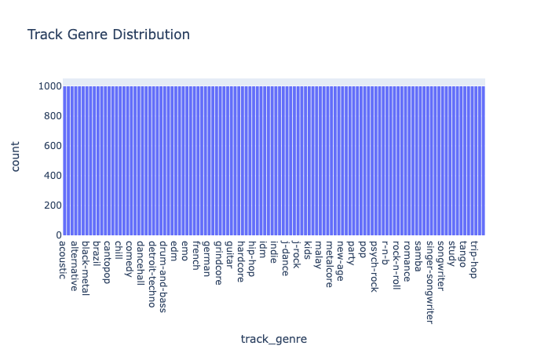
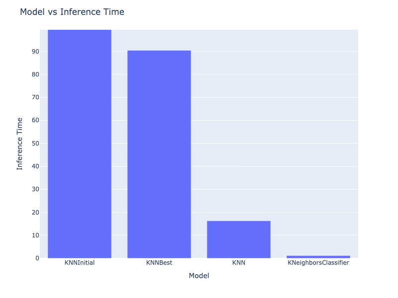
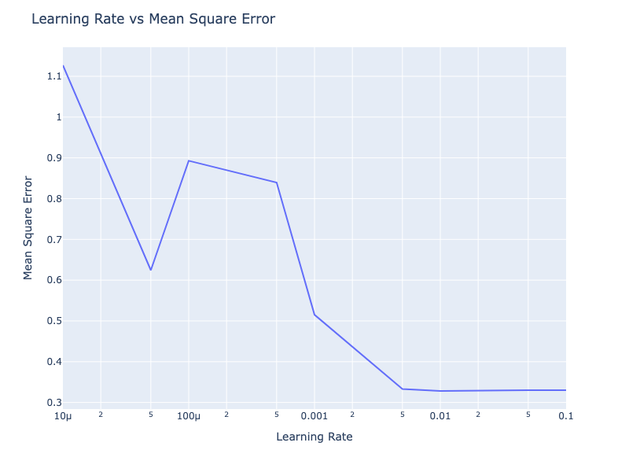
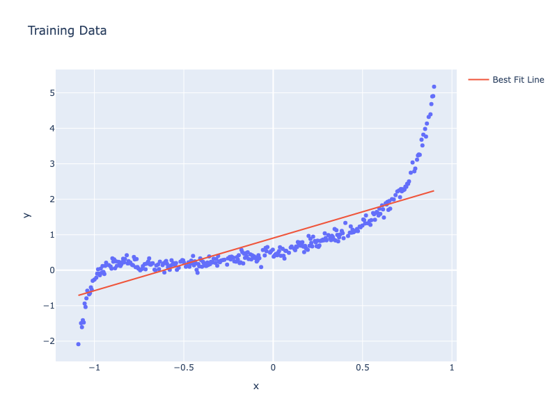

# SMAI Assignment 1 Report

## Table of contents

- [SMAI Assignment 1 Report](#smai-assignment-1-report)
  - [Table of contents](#table-of-contents)
- [K-Nearest Neighbours](#k-nearest-neighbours)
  - [Exploratory Data Analysis](#exploratory-data-analysis)
    - [General Information](#general-information)
    - [Missing Values](#missing-values)
    - [Track Genre Details](#track-genre-details)
    - [String Data Type Attributes](#string-data-type-attributes)
    - [Numeric Data Type Attributes](#numeric-data-type-attributes)
    - [Radial Plot](#radial-plot)
    - [Feature Heatmap](#feature-heatmap)
    - [Feature Importance](#feature-importance)
    - [Mutual information](#mutual-information)
  - [Datasets](#datasets)
  - [KNN Models](#knn-models)
  - [Performance Measures](#performance-measures)
  - [Hyperparameter Tuning](#hyperparameter-tuning)
    - [Better Results](#better-results)
  - [Optimization Details](#optimization-details)
  - [Spotify-2 Dataset](#spotify-2-dataset)
- [Linear Regression with Regularization](#linear-regression-with-regularization)
  - [Model Implementation](#model-implementation)
  - [Data Visualisation](#data-visualisation)
  - [Degree 1 Analysis](#degree-1-analysis)
    - [Sample Run of the model](#sample-run-of-the-model)
    - [Finding best learning rate](#finding-best-learning-rate)
  - [Degree \>1 analysis](#degree-1-analysis-1)
    - [Sample Run of the model](#sample-run-of-the-model-1)
    - [Finding best degree for polynomial fitting](#finding-best-degree-for-polynomial-fitting)
  - [Animation](#animation)
    - [Changing initial weights](#changing-initial-weights)
  - [Regularization](#regularization)
    - [Fitting higher degree polynomials](#fitting-higher-degree-polynomials)
    - [L1 Regularization](#l1-regularization)
    - [L2 Regularization](#l2-regularization)
    - [Comparison](#comparison)


# K-Nearest Neighbours

## Exploratory Data Analysis

### General Information

The dataset contains an un-named column as the first column which stores the ordering of the data points, so the same has been used as for the pandas indexing column.

The target column is `track_genre` and the classification task is to analyse how the data in the other columns affect this classification.

General information about the raw data:

```python
Total rows (data points) = 114000
Total attributes = 20
```

The inbuilt pandas library has the `data.info()` function to show the count of non-null entries and data type of the column for all the attributes. Here is the output for the same:

```python
Data columns (total 20 columns):
 #   Column            Non-Null Count   Dtype  
---  ------            --------------   -----  
 0   track_id          114000 non-null  object 
 1   artists           113999 non-null  object 
 2   album_name        113999 non-null  object 
 3   track_name        113999 non-null  object 
 4   popularity        114000 non-null  int64  
 5   duration_ms       114000 non-null  int64  
 6   explicit          114000 non-null  bool   
 7   danceability      114000 non-null  float64
 8   energy            114000 non-null  float64
 9   key               114000 non-null  int64  
 10  loudness          114000 non-null  float64
 11  mode              114000 non-null  int64  
 12  speechiness       114000 non-null  float64
 13  acousticness      114000 non-null  float64
 14  instrumentalness  114000 non-null  float64
 15  liveness          114000 non-null  float64
 16  valence           114000 non-null  float64
 17  tempo             114000 non-null  float64
 18  time_signature    114000 non-null  int64  
 19  track_genre       114000 non-null  object 
```

The data types distribution of the columns:

```python
dtypes: bool(1), float64(9), int64(5), object(5)
```

### Missing Values

Based on the above output, we notice that there are 3 null values - one in each of the columns `artists`, `album_name`, `track_name` all of data type `object`

A simple approach to deal with this might be to delete the data points which have null values but this may not be a feasible solution in case there were a lot more null values. So the solution chosen here is to **replace the null values** with the text `"Unknown"` as this preserves the total number of data points and string values generally contribute less to the classification task anyways.

In case there were numerical type data values, it would be better to replace the null values with the mean, median or mode of the column depending on the columns characteristics and logical contribution to the track genre. 

### Track Genre Details

There are a total of **114 unique genres**

Here is the bar chart of the distribution of the target class - `track_genre`



As we can notice, all the genres have the count as 1000 implying that the data set is a **stratified dataset**. Such a dataset has the advantage of not biasing towards a particular class just because of the high population in the dataset.

### String Data Type Attributes

```python
89741 Unique Track Ids
46590 Unique Album Names
73609 Unique Track Names
31438 Unique Artists
```

The best way for encoding these to numbers is to use a hash function modded to restrict the values to some range. Label encoding might work too but that may cause problems if there exists any inherent ordering in the dataset, and is thus not universal.

### Numeric Data Type Attributes

Here is the histogram charts for the numeric data type attributes


Here are the pie charts for the binary and categorical attributes:


Observations:

- Dancebility follows a nice gaussian distribution which implies that data preprocessing for this can be done by taking the z-score. There are very few outliers for very low values.
- Energy follows a linear increase with no outliers
- Duration, Loudness, Speechiness, Acousticness, Instrumentalness and Liveness seem to have a very sharp peek at one value and it’s nearby region.
- Outliers seem to be present in the plots for duration, dancebility, loudness and tempo and they can be shown using box plots as the general distribution of the data is clearly visible.
- Outliers for Speechiness, Acousticness and Instrumentalness can be shown using violin plots as the outliers become clearly visible and we get some idea about the data distribution in the peak region.

The general preprocessing idea for these is to z-index normalize all the features which follow gaussian distribution and linear normailze all the other features.

The Box Plots are shown below:


The points represent the outliers and we notice that -

- There are very few outliers for dancebility which are near the value 0 far away from most of the data.
- Duration has a lot of outliers which start close to the main distribution and continue evenly for the entire range
- Loudness and tempo have a lot of outliers after a small distance from the median of the data.

The Violin Plots are shown below:


Observations:

- These give us much better idea about the distribution around the median which was not very evident in the histogram.

These plots also show that all of the outliers are placed throughout the range.

### Radial Plot

Here is a radial plot of how the features contribute to the track genre (for only 5 genres):


Observations:

- There is a clear split of how the energy and loudness corresponds to the genre. Songs with high energy are rock and metal whereas sleep and acoustic have low energy
- Dancebility follows a similar relation with pop being the most danceable and sleep being the least as expected
- Only sleep has some value for instrumetalness whereas for the other genres it is almost 0

### Feature Heatmap

Here is the heatmap showing the co-relation among the features:


Observations:

- Loudness and energy are highly co-related (0.76) which was also evident in the radial plot.
- Acousticness and energy are negatively co-related (-0.73) which indicates that high energy music is not acoustic and vice-versa. Similarly, energy and acousticness also follow a similar trend due to the above point.
- Valence and dancebility are also somewhat related (0.47) as valence is the musical positiveness which is directly related to dancebility

### Feature Importance

We can try to identify which features actually make a valuable contribution to the genre prediction by calculating the importance of each feature. If the variance of a particular column is greater, then it generally conveys more information. Importance can be defined as the difference of the feature variance from the average of per group variance of the same feature. Here is the importance plot for the given data:


Observations:

- High importance score attributes like acousticness, instrumentalness, energy, valence, etc convey more information about the genre
- Low importance score attributes like temp, key, duration_ms and valence generally are irrelevant and can be removed in the preprocessing step.
- We can set a threshold of 0.002 to eliminate any noise from the low importance columns

### Mutual information

Mutual Information measures the reduction in uncertainty about one variable given knowledge of another. For categorical data, it quantifies how much knowing one category reduces uncertainty about the target category (track_genre). The scaling is done to indicate the spread of the class category across all the data points. Here is the plot for the categorical attributes:


Observations:

- Artists column has the highest score implying that knowing the artist name can reduce the uncertainty about the track_genre. This means that mostly each artist generally corresponds to one genre only.
- Album name and track name follow next with the same order.

## Datasets

- `data/interim/spotify_vis.csv` stores the linearly normalized all features used in plotting and extracting information for data analysis
- `data/processed/spotify.csv` stores the processed data which involves linearisation and z-score normalization of all the numeric attributes based on the distribution. There and no string attributes. The low feature importance attributes are removed as well.
- `data/processed/spotify_best.csv` stores the best processed data which considers the mutual information as well, including the artists name and increasing the feature importance threshold.

## KNN Models

There are 3 models made which perform the exact same operations only separated by their optimisation methods.

- `KNNInitial`: Initial KNN implementation that uses for loops for computation of the result for each data point in the test set
- `KNNBest`: Best KNN implementation that uses numpy default vectorization for faster computation
- `KNN`: Most optimized KNN implementation that uses parallel processing for faster computation

## Performance Measures

- `accuracy`: Calculates the fraction of times the model predicts the correct category
- `micro-precision`: Calculates precision globally by considering the sum of true positives and false positives across all classes
- `macro-precision`: Calculated as average of precision scores for each class. Precision is the proportion of positive predictions that are actually correct
- `micro-recall`: Calculates recall globally by considering the sum of true positives and false negatives across all classes
- `macro-recall`: Calculated as average of recall scores for each class. Recall is the proportion of actual positives that were identified correctly
- `micro-f1-score`: Harmonic mean of the micro precision and recall.
- `macro-f1-score`: Calculated as average of the F1 scores calculated for each class.

The output measures for one of the sample runs of the model looks like:

```python
K: 7, Metric: manhattan
Valdiation set metrics
        Accuracy: 0.23087719298245615
        Micro Precision: 0.23087719298245615
        Micro Recall: 0.23087719298245615
        Micro F1: 0.23087719298245618
        Macro Precision: 0.22127132961137674
        Macro Recall: 0.2310360638646531
        Macro F1: 0.21812787278667978
Test set metrics
        Accuracy: 0.2312280701754386
        Micro Precision: 0.2312280701754386
        Micro Recall: 0.2312280701754386
        Micro F1: 0.2312280701754386
        Macro Precision: 0.21867128582772877
        Macro Recall: 0.23038677563773038
        Macro F1: 0.21740270950586596
```

## Hyperparameter Tuning

The setup includes working on the `data/processed/spotify.csv` dataset with 80:10:10 train:val:test split on the most optimized KNN model.

Although k is generally taken as an odd value, here all the possible values from 1 to 20 have been considered.

The best accuracy is given with K as 28 and metric as Manhattan - 24.03%

The top 10 results are:

```python
K: 28, Metric: manhattan, Accuracy: 0.24026315789473685
K: 26, Metric: manhattan, Accuracy: 0.23991228070175438
K: 27, Metric: manhattan, Accuracy: 0.23991228070175438
K: 25, Metric: manhattan, Accuracy: 0.23956140350877192
K: 29, Metric: manhattan, Accuracy: 0.23903508771929824
K: 23, Metric: manhattan, Accuracy: 0.23894736842105263
K: 24, Metric: manhattan, Accuracy: 0.23780701754385966
K: 30, Metric: manhattan, Accuracy: 0.23771929824561402
K: 22, Metric: manhattan, Accuracy: 0.2374561403508772
K: 20, Metric: manhattan, Accuracy: 0.23596491228070177
```

Here is a graph showing the relation of k and accuracy for the three distance metrics (manhatten, euclidean, cosine)


Observations:

- The manhatten distance measure performs better compared to the other distance metrics euclidean and cosine.
- Euclidean performs slightly better than cosine for most of the k values.
- The accuracy sharply dips for k=2 as it the model tends to guess random among the nearest 2.
- There is a general trend of the even k values being lower than their immediate neighbour odd k values. This is why it is preferred to not use even k values for classification.
- Ideally we should check till sqrt(count) which is around 300. Results show that the accuracy barely changes and hovers around the range of 23%-25%.

The dataset used here is the processed form of the original dataset which does not contain few columns like [track_id, artists, album_name, track_name, tempo, time_signature, key, duration_ms]. These are mainly the string columns and the less important features below the threshold value which have been dropped as they don’t contribute much to the track_genre anyways.

### Better Results

Better results have been achieved by more preprocessing of the dataset to `data/processed/spotify_best.csv`. This dataset gives importance to the mutual information column as well. This dataset contains only very few columns [artists, energy, acousticness, instrumentalness, valence, track_genre]

The artists column has been encoded with a hashing function which is then clipped to 10000. All the other columns have been z-index normalized. Since the mutual information is very high for artists and the variance is also much bigger than that of other columns, the classification gets solely based on the aritsts and the other important columns act as deciders in case of ties.

This processed dataset gives much better accuracy than the previous dataset. Here are the best results for the same:

```python
K: 1, Metric: manhattan, Accuracy: 0.42771929824561405
K: 5, Metric: manhattan, Accuracy: 0.4266666666666667
K: 4, Metric: manhattan, Accuracy: 0.423859649122807
K: 2, Metric: manhattan, Accuracy: 0.422280701754386
K: 1, Metric: euclidean, Accuracy: 0.4218421052631579
```

Another approach could be to consider only the artists column, but this gives slightly worse results than above. The better results with this approach of dimensionality reduction matches the analysis made in the exploratory task under mutual information.

## Optimization Details

Here is a comparison of the model vs the inference time:

| Model  Inference Time | Inference Time  |
| --------------------- | --------------- |
| KNNInitial            | 2912.864003 sec |
| KNNBest               | 90.425209 sec   |
| KNN                   | 16.266830 sec   |
| KNeighborsClassifier  | 1.136843 sec    |

|  |  |
| --------------------------------------------------------------- | ----------------------------------------------------------------------------- |


Observations:

- KNNBest which is vectorized is better than KNNInitial which uses for loops. Almost 32.3x speedup
- KNN which is vectorized + multithreaded is the second fastest. Almost 5.6x faster than KNNBest
- The scikit nearest neighbours model is the fastest model. Almost 14.3x faster than KNN

Here is a comparison of the inference time vs the training dataset size for each model:

| Training Size | KNNInitial  | KNNBest   | KNN       | KNeighborsClassifier |
| ------------- | ----------- | --------- | --------- | -------------------- |
| 10            | 0.428065    | 0.135994  | 0.307590  | 0.220375             |
| 100           | 3.233835    | 0.169454  | 0.389177  | 0.167875             |
| 500           | 15.754416   | 0.391260  | 0.466979  | 0.199308             |
| 1000          | 31.363652   | 0.701749  | 0.460855  | 0.238665             |
| 5000          | 157.596842  | 3.918918  | 0.803702  | 0.420416             |
| 10000         | 316.340609  | 7.908599  | 1.337444  | 0.528131             |
| 50000         | 1594.759918 | 46.342478 | 8.474968  | 0.863198             |
| 91200         | 2861.261225 | 88.297474 | 17.230563 | 1.073463             |

|  |  |
| ----------------------------------------------------------------------- | ------------------------------------------------------------------------------------- |

Observations:

- The KNNInitial model time scales linearly with the number of training points as the for loop runs one by one for each point.
- Inference time for KNNBest model which is vecorized also scales linearly but with a much lesser slope. The vertoized operations still run one after the other.
- Inference time for KNN model which is parallelized into 50 chunks. Each chunk takes more time with increased training size, thus the same linear increase but with even lesser slope.
- The KNeighborsClassifier from sklearn always runs in under 1 sec which implies that it is highly optimized.

## Spotify-2 Dataset

Here are the results of running the KNN model with hyper-parameters k=28 and metric=manhattan on the spotify-2 dataset:. This processed dataset contains the relevant fields like spotify.csv based on the importance score.

```python
K: 28, Metric: manhattan
Valdiation set metrics
        Accuracy: 0.2324561403508772
        Micro Precision: 0.2324561403508772
        Micro Recall: 0.2324561403508772
        Micro F1: 0.2324561403508772
        Macro Precision: 0.2192146331416225
        Macro Recall: 0.23314576371776982
        Macro F1: 0.21754373813756211
Test set metrics
        Accuracy: 0.22850877192982455
        Micro Precision: 0.22850877192982455
        Micro Recall: 0.22850877192982455
        Micro F1: 0.22850877192982455
        Macro Precision: 0.21683188534380465
        Macro Recall: 0.22977973528450904
        Macro F1: 0.21482428309728
```

Here are the same metrics using the best processed spotify 2 dataset which contains fields based on the mutual information score as well:

```python
K: 1, Metric: manhattan
Valdiation set metrics
        Accuracy: 0.43201754385964913
        Micro Precision: 0.43201754385964913
        Micro Recall: 0.43201754385964913
        Micro F1: 0.43201754385964913
        Macro Precision: 0.4395193307356899
        Macro Recall: 0.4315480470236573
        Macro F1: 0.4336571277903526
Test set metrics
        Accuracy: 0.4303508771929825
        Micro Precision: 0.4303508771929825
        Micro Recall: 0.4303508771929825
        Micro F1: 0.4303508771929825
        Macro Precision: 0.4395449332453689
        Macro Recall: 0.4321635567330406
        Macro F1: 0.4339855724319505
```

As we can see, the results are very similar to what we got on the normal spotify dataset. This implies that our model is robust to dataset modifications. the 

# Linear Regression with Regularization

All the results mentioned are using the `data/processed/regression.csv` dataset.

## Model Implementation

The model is saved to `models/linear_regression/linreg.py` under the class name `LinearRegression`

The model written handles only one independent variable for any degree. The polynomial features function written does not account for multiple independent variables.

- Closed form with Ridge Regularization is not possible
- Closed form with Lasso Regularization uses the following form $\beta = (X^TX + \lambda I)^{-1}X^Ty$
- Gradient Descent uses the following form $\nabla = \frac{1}{n}X^T (X\beta - y)$
    - Ridge Regularization updates the gradient as $\nabla = \nabla+  \frac{2\lambda}{n}\beta$
    - Lasso Regularization updates the gradient as $\nabla = \nabla+  \frac{\lambda}{n}sign(\beta)$
    
    The weights are then updated by the learning rate factor
    

## Data Visualisation

Here are the graphs showing the distribution of train, test and val data

|  |  |  |
| ---------------------------------------------------- | ------------------------------------------------ | -------------------------------------------------- |

Here is all the above data plots in a single plot:


## Degree 1 Analysis

### Sample Run of the model

The LinearRegression model with degree as 1 and no regularization was run on the dataset and metrics are reported for each of the train, val and test dataset. Here are the metrics:

```python
Model run for degree: 1
Training Set
        Mean Square Error: 0.3330881699297934
        Standard Deviation: 0.5771348528985372
        Variance: 0.3330846384302162
Validation Set
        Mean Square Error: 0.4499143540779974
        Standard Deviation: 0.6692890798656875
        Variance: 0.44794787242745865
Test Set
        Mean Square Error: 0.4033170983345702
        Standard Deviation: 0.6347835796776845
        Variance: 0.40295019302841517
```

### Finding best learning rate

Here are the best results for different values of learning rates

| Learning Rate | Mean Square Error | Standard Deviation | Variance     |
| ------------- | ----------------- | ------------------ | ------------ |
| 0.10000       | 0.329906          | 0.574149           | 0.329647     |
| 0.05000       | 0.329906          | 0.574149           | 0.329647     |
| **0.01000**   | **0.328207**      | **0.572733**       | **0.328023** |
| 0.00500       | 0.332847          | 0.576903           | 0.332817     |
| 0.00100       | 0.515204          | 0.714600           | 0.510654     |
| 0.00050       | 0.839517          | 0.821265           | 0.674476     |
| 0.00010       | 0.892843          | 0.683728           | 0.467484     |
| 0.00005       | 0.624377          | 0.786317           | 0.618294     |
| 0.00001       | 1.127011          | 0.751926           | 0.565393     |



- The best learning rate is 0.01 where we have the lowest errors.
- The MSE increases mostly as the learning rate decreases with few irregularities

Here is what the graph of the best fit line on the training dataset looks like:



|  |  |
| ---------------------------------------------------------------------------- | ------------------------------------------------------------------------------ |

## Degree >1 analysis

### Sample Run of the model

The LinearRegression model with degree as 2 and no regularization was run on the dataset and metrics are reported for each of the train, val and test dataset. Here are the metrics:

```python
Model run for degree: 2
Training Set
        Mean Square Error: 0.2673289769134472
        Standard Deviation: 0.5169613812370926
        Variance: 0.2672490696905626
Validation Set
        Mean Square Error: 0.14307077219506306
        Standard Deviation: 0.3695082545177456
        Variance: 0.13653635015675109
Test Set
        Mean Square Error: 0.11678627563370333
        Standard Deviation: 0.33915747784678363
        Variance: 0.11502779477939154
```

### Finding best degree for polynomial fitting

Setting the learning rate to 0.01 and calculating the metrics on the dataset to evaluate the best degree for the polynomial, here are the results:

Using Gradient Descent Approach with 10000 epochs

| Degree | Mean Square Error | Standard Deviation | Variance |
| ------ | ----------------- | ------------------ | -------- |
| 22     | 0.010217          | 0.087143           | 0.007594 |
| 19     | 0.010290          | 0.086021           | 0.007400 |
| 17     | 0.010616          | 0.088524           | 0.007837 |
| 20     | 0.010674          | 0.088083           | 0.007759 |
| 18     | 0.010840          | 0.089689           | 0.008044 |

Using closed form calculation:

| Degree | Mean Square Error | Standard Deviation | Variance |
| ------ | ----------------- | ------------------ | -------- |
| 21     | 0.009909          | 0.086492           | 0.007481 |
| 16     | 0.010552          | 0.087427           | 0.007644 |
| 7      | 0.010595          | 0.092428           | 0.008543 |
| 15     | 0.010606          | 0.088778           | 0.007881 |
| 17     | 0.010672          | 0.089134           | 0.007945 |

Here are the plots for the same:

|  Gradient Descent |  Closed Form |
| -------------------------------------------------------------------------- | ---------------------------------------------------------------- |

Observations:

- As it is evident from the above plots, the MSE is almost constant for any degree more than roughly 7. There are very minor changes in MSE for these values, which is why the tables for gradient descent and closed form calculation result in somewhat different values.
- The reason for this is also the fact that the data is very closely distributed with no outliers. This means that higher degree polynomials are only micro-over-fitting the data which is not giving much difference in the MSE and other metrics.
- Degrees 1,2,3 have high MSE indicating that they are mostly underfitting the data without having learnt about the data entirely
- The random peak around degree 23 in the closed form graph is mostly due to instability of matrix inversion operations at higher dimensions.

For the sake of further computations, degree 21 has been considered as the most optimal degree for the given dataset.

## Animation

The plots are plotted till either the MSE, Standard Deviation or Variance start increasing which indicates convergence of the metric. 

Here are the attached gifs for degrees 1,2,5,17 and 21

|  degree 1 |  degree 2    |
| ------------------------------------------------------------ | --------------------------------------------------------------- |
|  degree 5 |  degree 21 |

The number of epochs for convergence in the above cases with random initialization are:

```python
Degree 1: 97 epochs
Degree 2: 21 epochs
Degree 5: 82 epochs
Degree 17: 24 epochs
Degree 21: 999+ epochs
```

### Changing initial weights

We can observe the change in convergence rate on updating the initial weights of the model. This sort of introduces a bias which is corrected by gradient descent. Here are the animated gifs for degree 17 but with different initializations:

|  degree 17 random |  degree 17 zeros |  degree 17 ones |
| ---------------------------------------------------------------------------- | ------------------------------------------------------------------------------- | ---------------------------------------------------------------------------- |

```python
Degree 17
Random Initial Weights: 24 epochs
Weights initialized to all 0: 999+ epochs
Weights initialized to all 1: 999+ epochs
```

Here we can see how a random initialization turns out to be better as it converges much quicker than the other two cases. Initializing it with all 0’s or all 1’s seems to take a lot of time to converge (more than 1000 epochs)

## Regularization

All the results mentioned are using the `data/processed/regularisation.csv` dataset.

### Fitting higher degree polynomials

Here are the metrics of how degree compares to the mse, standard deviation and variance:

| Degree | MSE        | Standard Deviation | Variance   |
| ------ | ---------- | ------------------ | ---------- |
| 1      | 0.1341     | 0.3388             | 0.1148     |
| 2      | 0.0283     | 0.1456             | 0.0212     |
| 3      | 0.0236     | 0.1364             | 0.0186     |
| 4      | 0.0115     | 0.0974             | 0.0095     |
| 5      | 0.0166     | 0.1195             | 0.0143     |
| 6      | 0.0136     | 0.1088             | 0.0118     |
| **7**  | **0.0102** | **0.0975**         | **0.0095** |
| 8      | 0.0148     | 0.1203             | 0.0145     |
| 9      | 0.0112     | 0.1010             | 0.0102     |
| 10     | 0.0131     | 0.1137             | 0.0129     |
| 11     | 0.0207     | 0.1432             | 0.0205     |
| 12     | 0.0165     | 0.1280             | 0.0164     |
| 13     | 0.0300     | 0.1731             | 0.0300     |
| 14     | 0.0246     | 0.1569             | 0.0246     |
| 15     | 0.0209     | 0.1445             | 0.0209     |
| 16     | 0.0291     | 0.1704             | 0.0291     |
| 17     | 0.0240     | 0.1547             | 0.0239     |
| 18     | 0.0406     | 0.2014             | 0.0406     |
| 19     | 0.0331     | 0.1819             | 0.0331     |
| 20     | 0.0186     | 0.1349             | 0.0182     |


The best fitting curve is for degree 7 which gives the lowest MSE of 0.0102 on the dataset

### L1 Regularization

Here are the metrics for lasso regression with lambda as 1:

| Degree | MSE        | Standard Deviation | Variance   |
| ------ | ---------- | ------------------ | ---------- |
| 1      | 0.1791     | 0.4230             | 0.1789     |
| 2      | 0.0323     | 0.1770             | 0.0313     |
| 3      | 0.0268     | 0.1607             | 0.0258     |
| 4      | 0.0156     | 0.1234             | 0.0152     |
| 5      | 0.0112     | 0.1038             | 0.0108     |
| 6      | 0.0088     | 0.0937             | 0.0088     |
| **7**  | **0.0076** | **0.0873**         | **0.0076** |
| 8      | 0.0148     | 0.1211             | 0.0147     |
| 9      | 0.0084     | 0.0912             | 0.0083     |
| 10     | 0.0166     | 0.1282             | 0.0164     |
| 11     | 0.0079     | 0.0853             | 0.0073     |
| 12     | 0.0105     | 0.1019             | 0.0104     |
| 13     | 0.0097     | 0.0935             | 0.0087     |
| 14     | 0.0088     | 0.0905             | 0.0082     |
| 15     | 0.0143     | 0.1190             | 0.0142     |
| 16     | 0.0188     | 0.1358             | 0.0184     |
| 17     | 0.0116     | 0.1058             | 0.0112     |
| 18     | 0.0151     | 0.1135             | 0.0129     |
| 19     | 0.0153     | 0.1166             | 0.0136     |
| 20     | 0.0114     | 0.0980             | 0.0096     |


Degree 7 polynomial still seems to be the best fit in this case.

We can clearly notice how the higher degree polynomials fit the data points much better than without any regularization

### L2 Regularization

Here are the metrics for lasso regression with lambda as 1:

| Degree | MSE        | Standard Deviation | Variance   |
| ------ | ---------- | ------------------ | ---------- |
| 1      | 0.1852     | 0.4282             | 0.1833     |
| 2      | 0.0270     | 0.1624             | 0.0264     |
| 3      | 0.0316     | 0.1743             | 0.0304     |
| **4**  | **0.0098** | **0.0990**         | **0.0098** |
| 5      | 0.0109     | 0.1040             | 0.0108     |
| 6      | 0.0130     | 0.1135             | 0.0129     |
| 7      | 0.0131     | 0.1129             | 0.0128     |
| 8      | 0.0117     | 0.1079             | 0.0116     |
| 9      | 0.0241     | 0.1550             | 0.0240     |
| 10     | 0.0477     | 0.2183             | 0.0476     |
| 11     | 0.0123     | 0.1110             | 0.0123     |
| 12     | 0.0352     | 0.1875             | 0.0352     |
| 13     | 0.0218     | 0.1475             | 0.0218     |
| 14     | 0.0318     | 0.1779             | 0.0316     |
| 15     | 0.0374     | 0.1931             | 0.0373     |
| 16     | 0.0416     | 0.2032             | 0.0413     |
| 17     | 0.0242     | 0.1553             | 0.0241     |
| 18     | 0.0313     | 0.1768             | 0.0313     |
| 19     | 0.0566     | 0.2378             | 0.0566     |
| 20     | 0.0385     | 0.1961             | 0.0385     |


Degree 4 polynomial is the best fit now.

We can clearly notice how the higher degree polynomials fit the data points much better than without any regularization

### Comparison

Here are the plots showing the comparison of MSE, variance and standard deviation in the three methods:

|  |  |  |
| ------------------------------------------------------------ | ------------------------------------------------------------ | ------------------------------------------------------------ |

Observations:

- L1 regularization gives the best results for higher degree polynomials
- The comparison between L2 and no regularization is not very clear as there are occasional spikes at few of the higher degree terms
- Higher values of lambda can be used to regularize even more.