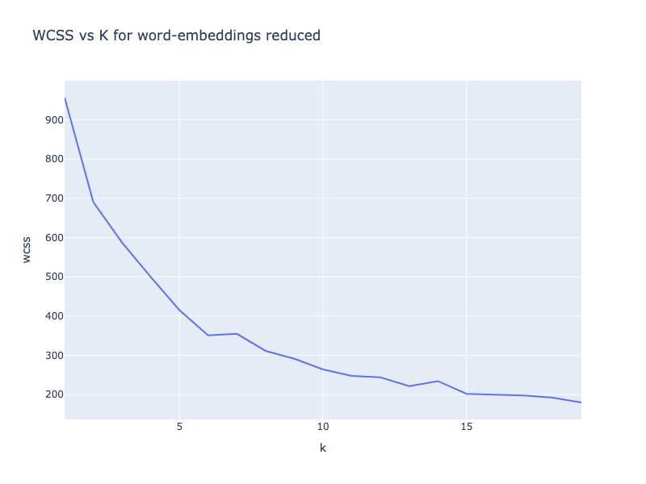
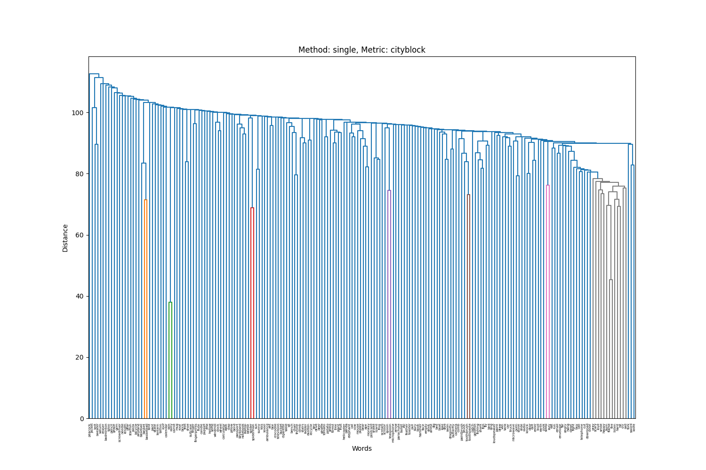

# SMAI Assignment 2 Report

# K-Means Clustering

## Implementation Details

The model is created as `KMeans` class in `models/k_means/k_means.py`. The hyper-parameters are the number of clusters(k) and the cost_threshold to stop the training (default value of 1e-6)

The `fit()`function first randomly picks k points to serve as the cluster centroids and then iteratively updates these as the mean of the cluster points till the within cluster sum of squares error changes by a margin as low as the cost_threshold.

The `predict()` function takes in the data points and outputs the cluster indices they belong to.

The `getCost()` function returns the within cluster sum of squares.

### Testing Implementation

To test if the model correctly clusters the points, a dummy test dataset at `data/external/2d-clustering-data.csv` has been used.

Here is the plots of the original data with the default colours and the plot of the data with the assigned clusters (k=3)

|||
|-|-|


## Results on word-embeddings dataset

### Data processing

The original data at `data/external/word-embeddings.feather` has been processed by removing the `words` column and expanding the `vit` column to 512 different columns. The processed data has been stored at `data/processed/word-embeddings.csv` .

### Finding Optimal number of clusters

The elbow method looks for the point where adding more clusters does not significantly improve the fit within the clusters. To determine this elbow point for the dataset, we plot the number of clusters vs within cluster sum of squares (wcss) and find such a point.


From the graph, the elbow point is 4 as increasing the number of clusters from 4 to 5 did not change the WCSS by a huge amount.

On successive runs, the elbow point seems to be hovering around the k values range 4-7, and most of the times it is at 4.

**$k_{kmeans1} = 4$ is the optimal number of clusters as per K-Means**

### Sample clustering result

Performing k-means clustering on the word embeddings dataset with k as 4 gives the following result:

```python
KMeans clustering with k = 4 on word-embeddings data
    Final WCSS: 4089.04
    Points in each cluster:
        Cluster 0 : 16
        Cluster 1 : 64
        Cluster 2 : 50
        Cluster 3 : 70
```

# Gaussian Mixture Models

## Implementation Details

The model is created as `GMM` class in `models/gmm/gmm.py`. The hyper-parameters are the number of clusters(k) and the cost_threshold to stop the training (default value of 1e-6)

The `fit()`function uses expectation-maximisation to find the parameters - means, covariances and mixing coefficients of the model. 

Expectation Step: The responsibilities are calculated as the probability of the cluster being assigned to the given data point.

Maximisation Step: The parameters are updated based on the calculated responsibilities and datapoints

The process is repeated till the change in log likelihood loss is less than the cost_threshold

The `getParams()` function returns the parameters - means, covariances and mixing coefficients of the model

The `getMembership()` function returns the responsibility or membership values of each data point for all the clusters

The `getLikelihood()` and `getLogLikelihood()` functions return the likelihood and log likelihood of the points belonging their the clusters based on the responsibility values for all the points.

The model uses scipy multivariate normal function which handles the cases where the covariant matrix is singular while taking the inverse or dividing with the determinant(0)

### Testing Implementation

To test if the model correctly clusters the points, a dummy test dataset at `data/external/2d-clustering-data.csv` has been used.

Here is the plots of the original data with the default colours and the plot of the data with the assigned clusters (k=3) with soft assignment of clusters

|||
|-|-|


## Results on word-embeddings dataset

### Data processing

The original data at `data/external/word-embeddings.feather` has been processed by removing the `words` column and expanding the `vit` column to 512 different columns. The processed data has been stored at `data/processed/word-embeddings.csv` 

### Testing implementation

Trying to run the model with number of clusters as 3 gives the following output:

```python
# My GMM class
GMM clustering with k = 3 on word-embeddings data
      Final likelihood: inf
      Final log-likelihood: 34256.23
      AIC: 722531.5405469433
      BIC: 2027088.6219987557
# sklearn Gaussian Mixture class
GMM clustering with k = 3 on word-embeddings data
      Final likelihood: inf
      Final log-likelihood: 517604.77
      AIC: -244165.54597792297
      BIC: 1060391.5354738897
```

Clearly, there is a difference between the results of my class and the sklearn model. Specifically, the log likelihood seems to decrease rather than increase for our model which is what prevents the actual convergence to the true value by sklearn model.

**Reason for error?**

Essentially, since the number of dimensions of the dataset (512) is more than the data points we have (200), the covariance matrix almost always tends to be singular. The main reason being that the covariance matrix becomes rank deficient (as there are only 200 datapoints) and thus features become linearly dependent making the determinant 0 for the matrix.

This results in the multivariate normal pdf being 0 for most points (as covariance is singular) implying that likelihood of some points is very low and this leads to numerical instability. This causes stuff like the sum of responsibilities for a datapoint over all clusters to be 0 (which is not possible) resulting in erroneous values for log likelihood.

My GMM class works well where such errors don’t happen like on smaller dimensional datasets and the results are very similar to sklearn model.

**How sklearn handles this?**

Regarding the singular covariance matrix problem, the sklearn model has two checks in place - 

Regularisation term ($+\lambda I)$ added to the covariance matrix to make it positive definite.

Precision matrix to store the inverse of the covariance matrix. As mentioned in the sklearn documentation - Storing the precision matrices instead of the covariance matrices makes it more efficient to compute the log-likelihood of new samples at test time. Cholesky decomposition of this matrix is preferred over directly inverting the covariance matrix because it is both computationally efficient and numerically stable. 

The regularisation term ensures that Cholesky decomposition is possible and this decomposition is used for multivariate normal in the responsibility calculation.

### Finding Optimal number of clusters

The AIC (Akaike Information Criterion) and BIC (Bayesian Information Criterion) are used to determine the optimal number of clusters for the GMM model fitted to the dataset. These quantities weigh the trade-off between goodness-of-fit and complexity. Lower values of AIC and BIC indicate good tradeoff.

$$
AIC = 2k-2l \text{, } BIC = klog(n) - 2l
$$

Where, $k$ is the number of model paramters, $l$ is the maximum log-likelihood and $n$ is the number of datapoints.


From the graph, the best trade off is at 1 cluster as increasing the number of clusters increases both AIC and BIC. This is mainly due the fact that the data is 512 dimensional with only 300 datapoints.

**$k_{gmm1} = 1$ is the optimal number of clusters as per GMM**

### Sample clustering result

Performing GMM clustering using the sklearn model on the word embeddings dataset with k as 1 gives the following result:

```python
GMM clustering with k = 1 on word-embeddings data
      Final likelihood: inf
      Final log-likelihood: 375255.27
      AIC: -486830.5488837117
      BIC: -51980.387278018636
```

# Dimensionality Reduction and Visualisation

## PCA Implementation

The model is created as `PCA` class in `models/pca/pca.py`. The hyper-parameters is the final number of components(n_components).

The `fit()`function obtains the n_components principal components of the dataset. This is done by truncating the $V^T$ matrix of the SVD decomposition of the dataset.

The `transform()` function takes in the data points and projects them to the principal axes determined by the fit function.

The `checkPCA()` function checks if the reduced components can properly reconstruct the original dataset by printing the Mean Squared Error between the reconstructed and original and returning True if the difference is less than 0.1, otherwise False.

## Dimensionality Reduction

Here are the results of performing PCA to 2 and 3 components on the word embeddings dataset:

```python
Reconstruction error in checkPCA(): 0.038359611616054216
PCA implementation check for 2 componenets: True
Reconstruction error in checkPCA(): 0.036926228885971545
PCA implementation check for 3 componenets: True
```


### Data Analysis

The new axes obtained from PCA represent the top 2/3 significant eigen-vectors (based on the eigen values) of the covariance matrix of the dataset. These are the axis along which the variance of the data is maximum thus capturing most of the significant information in the data.

**Semantic understanding**

Here is the 2d plot with all the words:


(Below inference done with the help of LLMs)

The first principal component, encodes something along the lines of emotions. The high -ve values represent emotions or something with some level of engagement, whereas the high +ve values represent neutral objects with little level of emotion.

The second principal component, encodes something along the lines of distinction between animate/biological and inanimate/artificial. The high -ve values are related to living beings or actions associated with life, whereas the high +ve values represent inanimate or artificial objects.

Based on observation of the above plots, the approximate number of clusters is 3. There is one highly dense cluster and two sparse clusters.

**$k_2=3$ is the approximate number of clusters based on PCA**

# PCA + Clustering

## K-Means clustering based on 2D Visualisation

Here is the output of performing k-means clustering with 3 clusters ($k_2$):

```python
KMeans clustering with k = 3 on word-embeddings data
    Final WCSS: 4169.24
    Points in each cluster:
            Cluster 0 : 59
            Cluster 1 : 83
            Cluster 2 : 58
```

## PCA + K-Means

Scree plot of the eigenvalues vs the principal component is plotted to determine the number of needed components. Here are the plots:


Zooming in the range of 1-15 Principal Components:


There is an elbow point at 5 components implying that adding more components doesn’t greatly contribute to explaining the variance.

**Optimal number of dimensions is 5**

The reduced dataset containing the 5 principal components is stored in `data/processed/word-embeddings-reduced.csv`

To find the optimal number of clusters on the reduced dataset, we plot the number of clusters vs within cluster sum of squares (wcss) and find the elbow point.



From the graph, the elbow point is 6 as increasing the number of clusters from 6 to 7 did not change the WCSS by a huge amount.

On successive runs, the elbow point seems to be hovering around the k values range 5-11, and most of the times it is at 6.

**$k_{kmeans3} = 6$ is the optimal number of clusters as per K-Means on the reduced dataset**

Performing k-means clustering on the reduced word embeddings dataset with k as 6 gives the following result:

```python
KMeans clustering with k = 6 on word-embeddings-reduced data
    Final WCSS: 388.63
    Points in each cluster:
        Cluster 0 : 52
        Cluster 1 : 15
        Cluster 2 : 38
        Cluster 3 : 25
        Cluster 4 : 34
        Cluster 5 : 36
```

## GMM Clustering based on 2D Visualisation

Here is the output of performing GMM clustering with 3 clusters ($k_2$):

```python
# My GMM Class
GMM clustering with k = 3 on word-embeddings dataFinal likelihood: inf
    Final log-likelihood: 28525.57
    AIC: 733992.8547769341
    BIC: 2038549.9362287468
```

## PCA + GMMs

To find the optimal number of clusters based on the reduced dataset, we plot the AIC and BIC values against the number of clusters. 


The minimum value of both is well balanced at k=3, making the optimal number of clusters as 3.

$k_{gmm3} = 3$  **is the optimal number of clusters as per GMM on the reduced dataset**

Here is the output of GMM clustering of the reduced dataset with number of clusters as 3:

```python
GMM clustering with k = 3 on word-embeddings-reduced data
    Final likelihood: 0.0
    Final log-likelihood: -1175.02
    AIC: 2474.041135330778
    BIC: 2678.5368120567564
```

# Cluster Analysis

Analysis parameters:

1. Semantic understanding of words in each cluster
2. Inter-cluster distance - average distance between the cluster centroids
3. Intra-cluster distance - average distance between the cluster points and it’s centroid for all clusters
4. Silhouette score - average over each data point’s similarity to the cluster it belongs to and how different it is from other clusters

## K-Means Cluster Analysis

- Original Dataset: $k_{kmeans1} = 4$
    - Mathematical Analysis
        
        ```python
        Average Intra-cluster distances: 1014.3904843901612
        Average Inter-cluster distances: 6.904768309708463
        Average Silhouette score: 0.03833578034332508
        ```
        
    - Semantic Analysis
        
        
        | Cluster | Category | Examples |
        | --- | --- | --- |
        | 1 | Objects/Indoor Settings | ape, cat, table, bed, laptop, chair, pillow, ambulance, television, camera |
        | 2 | Animals/Creatures | deer, panda, bear, shark, giraffe, frog, starfish, butterfly, elephant |
        | 3 | Outdoor Activities/Tools | drive, fishing, grass, forest, spoon, climb, baseball, boat, fish, skateboard |
        | 4 | Actions/Emotions | sing, dive, knock, eat, call, fly, catch, run, cry, burn, love, cook |
- Visual inspection of principal components: $k_2=3$
    - Mathematical Analysis
        
        ```python
        Average Intra-cluster distances: 1384.1235350762788
        Average Inter-cluster distances: 6.19197323365423
        Average Silhouette score: 0.036707451454903145
        ```
        
    - Semantic Analysis
        
        
        | Cluster | Category | Examples |
        | --- | --- | --- |
        | 1 | Animals/Nature/Actions | drive, panda, ape, cat, bear, giraffe, fly, monkey, skate, tree, walk |
        | 2 | Actions/Emotions | sing, listen, eat, call, run, sleep, cry, burn, fire, love, angry, cook |
        | 3 | Objects/Tools/Appliances | helicopter, needle, brush, microwave, laptop, feather, notebook, fork, radio |
- Reduced dataset: $k_{kmeans3} = 6$
    - Mathematical Analysis
        
        ```python
        Average Intra-cluster distances: 58.345465081932275
        Average Inter-cluster distances: 8.309722270960817
        Average Silhouette score: 0.2754902337724957
        ```
        
    - Semantic Analysis
        
        
        | Cluster | Category | Examples |
        | --- | --- | --- |
        | 1 | Actions/Outdoor/Nature | drive, sing, fishing, fly, climb, basket, fish, swim, walk, tattoo |
        | 2 | Household Objects | table, bed, microwave, laptop, calendar, door, pillow, suitcase, toaster |
        | 3 | Animals/Creatures | deer, bear, shark, giraffe, frog, monkey, starfish, butterfly, elephant |
        | 4 | Daily Activities/Tools | panda, cat, gym, eat, run, pencil, dig, sun, camera, car, potato |
        | 5 | Tools/Small Objects | needle, eraser, brush, spoon, flute, screwdriver, sword, fork, paintbrush |
        | 6 | Actions/Emotions | listen, flame, knock, fight, cry, sleep, pray, burn, angry, love, cook |

**Overall Analysis**

Mathematically, we notice that the intra-cluster distance is very high for k=4 and k=3 compared to k=6. This implies that the clusters are more compact for k=6 which is ideally what a good cluster should be. The inter-cluster is almost similar but as a higher value is preferred, k=6 is better. Low silhouette score values for k=4 and k=3 indicate that the points generally lie in the boundary of the two clusters, and a high value for k=6 implies better clustering. An important thing to note is that the k=6 clustering is done on the centred dataset with the principal component axes making it hard to directly compare mathematically with the other two cases.

Semantically, k=4 does the best job of categorising the data points. There is an overlap of clusters or mismatch of data points in the other two cases of k=3 and k=6.

Overall, the best clustering results based on meaningfulness and interpretability is for k=4 on the original dataset. 

**$k_{kmeans}=4$ is the optimal number of clusters based on coherence and interpretability of clusters**

## GMM Cluster Analysis

- Original Dataset: $k_{gmm1} = 1$
    - Mathematical Analysis
        
        ```python
        Average Intra-cluster distances: 4527.93663666962
        Average Inter-cluster distances: nan
        Average Silhouette score: nan
        ```
        
    - Semantic Analysis (Hard Clustering)
        
        
        | Cluster | Category/Theme | Examples |
        | --- | --- | --- |
        | 1 | Actions/Emotions/Objects/Activities | drive, sing, deer, panda, ape, listen, rose, dive, flame, helicopter, sit, knock, cat, needle, eraser, table, carrot, exit |
- Visual inspection of principal components: $k_2 = 3$
    - Mathematical Analysis
        
        ```python
        Average Intra-cluster distances: 1383.7650268655896
        Average Inter-cluster distances: 6.227528994038984
        Average Silhouette score: 0.025897948000372654
        ```
        
    - Semantic Analysis (Hard Clustering)
        
        
        | Cluster | Category | Examples |
        | --- | --- | --- |
        | 1 | Actions/Emotions | sing, listen, smile, knock, eat, call, cry, run, sleep, burn, angry, love, cook |
        | 2 | Objects/Creatures | deer, panda, cat, table, pencil, giraffe, spoon, feather, starfish, tree, elephant, radio, suitcase |
        | 3 | Outdoor Activities/Nature | drive, fishing, bear, spider, forest, frog, lake, climb, boat, fish, snake, butterfly, truck |
    - There are no words which have significant probability in more than one cluster.
- Reduced dataset: $k_{gmm3} = 3$
    - Mathematical Analysis
        
        ```python
        Average Intra-cluster distances: 217.74640809982216
        Average Inter-cluster distances: 5.094434426667777
        Average Silhouette score: 0.161238539349387
        ```
        
    - Semantic Analysis (Hard Clustering)
        
        
        | Cluster | Category/Theme | Examples |
        | --- | --- | --- |
        | 1 | Animals/Plants/Natural Elements | deer, panda, ape, rose, helicopter, cat, smile, bear, spider, shark, grass, giraffe, forest, lizard, frog |
        | 2 | Actions/Emotions/Objects/States | listen, flame, sit, knock, exit, brick, bury, download, eat, postcard |
        | 3 | Objects/Tools/Various Items | drive, sing, dive, needle, eraser, table, carrot, fishing, bullet, brush, mug, feather, spoon, bend, puppet, gym, lake |
    - Points like drive, sing, dive, brick, forest, etc lie very close to the boundary of two clusters but the hard clustering forces them to be in one. This results in lower semantic clustering between the points

**Overall Analysis**

Mathematically, we cannot make any comparison based on the inter-cluster distance as it is not defined for k=1, and for k=3 it is done on datasets with different axes (one is the original and the other contains the principal components only). The inter-cluster is high for 1 cluster, obviously as there are no other clusters. Low silhouette score on the original dataset indicate that the points generally lie in the boundary of the two clusters, and a high value on the reduced dataset implies better clustering.

Semantically, no inference can be made about the the 1 cluster case. k=3 on the reduced dataset has overlapping categories. Thus k=3 on the original dataset performs the best in case of clearly semantically defining the clusters.

Overall, the best clustering results based on meaningfulness and interpretability is for k=3 on the original dataset. 

**$k_{gmm}=3$ on the original dataset is the optimal number of clusters based on coherence and interpretability of clusters**

## K-Means vs GMM Cluster Analysis

### Mathematical Analysis

(Both the comparisons are on the original 512 dimensional dataset)

|  | K-Means (k=4) | GMM (k=3) |
| --- | --- | --- |
| Intra-cluster | 1014.3904 | 1383.7650 |
| Inter-cluster | 6.9047 | 6.2275 |
| Silhouette | 0.0383 | 0.0258 |

Better clustering is indicated by lower intra-cluster score, higher inter-cluster score and higher silhouette score. The K-Means clustering approach performs better in all these three values compared to the GMM hard clustering approach. 

### Semantic Analysis

```python
Clusters in K-Means with k=4:
		Objects/Indoor Settings
		Animals/Creatures
		Outdoor Activities/Tools
		Actions/Emotions
		
Clusters in GMM with k=3:
		Actions/Emotions
		Objects/Creatures
		Outdoor Activities/Nature
```

Here also, K-Means does a better job than GMM. Categories like Objects and Creates are semantically different which has been separated in K-Means but not in GMM. The categories in K-Means also represent higher separation semantically as there are very few words that can actually be ambiguous to the categories.  In GMM stuff like nature and objects is different clusters but as mentioned before, words like brick may be ambiguous. 

**K-Means with k=4 is the better clustering approach for the 512 dimensional dataset**

# Hierarchical Clustering

## Implementation Details

The `hc.linkage()` function takes in the data matrix (512 dimensions) with 200 datapoints along with the method and metric for computing the clusters. The output contains (200-1) steps of agglomeration with each row giving the point indices to be merged, the distance between them and the number of points in the newly merged cluster.

The `method` argument specifies the type of linkage method to be used. The available options are single, complete, average, and ward. The exact difference between the methods can be found on the official documentation [here](https://docs.scipy.org/doc/scipy/reference/generated/scipy.cluster.hierarchy.linkage.html#scipy.cluster.hierarchy.linkage)

The `metric` argument specifies the type of distance metric to be used for pairwise distance between points in n-dimensional space. The available options are euclidean, city-block(manhattan) and cosine. The exact difference between the metrics can he found on the official documentation [here](https://docs.scipy.org/doc/scipy/reference/generated/scipy.spatial.distance.pdist.html#scipy.spatial.distance.pdist)

The `hc.dendogram()` gets the dendrogram corresponding tot he linkage matrix provided.

## Sample Result

Here is the output of hierarchical clustering on the original dataset with the linkage method as ward and metric as euclidean:

```python
Linkage Matrix:
[[148.         176.           2.08776529   2.        ]
 [  8.         127.           2.5120195    2.        ]
 [ 22.         123.           3.76979249   2.        ]
 [ 36.          59.           3.8860424    2.        ]
  ...
 [380.         394.          12.71493462  89.        ]
 [395.         396.          14.56810834 149.        ]
 [392.         397.          21.62536411 200.        ]]
```


## Comparison of methods and metrics

Here are the plots for different linkage and distance metrics

||||
|-|-|-|
||||
||||

Observations:

Single linkage methods tend to produce longer chains of points. Instead of compact groups, clusters may stretch across a range of values, blending into each other. Average and complete linkage produce more balanced dendrograms.

Cosine similarity measures the angle between two points rather than their absolute distance. The plots are tighter, skewed dendrogram with many initial small clusters being formed, before merging them into larger clusters.

Manhattan and Euclidean distance metric produce well balanced dendrograms. Manhattan is sensitive to variations in individual features whereas Euclidean takes the space distance into consideration. 

Complete linkage forms more compact and evenly spaced clusters since it focuses on the farthest points. Average linkage produces more elongated or spread-out clusters

**The best linkage method for euclidean distance metric is complete linkage**

Here is again the plot of the euclidean metric with complete linkage on the dataset:


## Creating Clusters and Analysis

- With k=4 (K-Means)
    - Mathematical Analysis
        
        ```python
        Average Intra-cluster distances: 1043.8645832832995
        Average Inter-cluster distances: 14.004249288803015
        Average Silhouette score: 0.015390272423249259
        ```
        
    - Semantic Analysis
        
        
        | Cluster | Category | Examples |
        | --- | --- | --- |
        | 1 | Actions/States | sit, eat, dig, run, clap, sad, buy |
        | 2 | Actions/Emotions/Objects/States | drive, sing, listen, dive, flame, knock, exit, brick, smile, bullet |
        | 3 | Objects/Animals/Tools/Various Items | deer, panda, ape, rose, helicopter, cat, needle, eraser, table, carrot |
        | 4 | Specific Items | knit, sweater, peacock, badminton, igloo |
        
        These clusters are also not very semantically related. There is overlap of categories for few data points and the categories are vague.
        
- With k=3 (GMM)
    - Mathematical Analysis
        
        ```python
        Average Intra-cluster distances: 1412.0049296719678
        Average Inter-cluster distances: 11.210571719101443
        Average Silhouette score: 0.039114004804135336
        ```
        
    - Semantic Analysis
        
        
        | Cluster | Category | Examples |
        | --- | --- | --- |
        | 1 | Actions/Emotions/Objects/States | drive, sing, listen, dive, flame, sit, knock, exit, brick, smile |
        | 2 | Objects/Animals/Various Items | deer, panda, ape, rose, helicopter, cat, needle, eraser, table, carrot |
        | 3 | Specific Items | knit, sweater, peacock, badminton, igloo |
        
        These clusters are also not very semantically related. There is overlap of categories for few data points and the categories are vague.
        

## Comparison with K-Means and GMM

- Difference with K-Means for k=4
    
    
    |  | K-Means (k=4) | Hierarchical (k=3) |
    | --- | --- | --- |
    | Intra-cluster | 1014.3904 | 1043.864 |
    | Inter-cluster | 6.9047 | 14.004 |
    | Silhouette | 0.0383 | 0.0153 |
    
    The inter cluster is higher for hierarchical as expected as the points/groups with farthest distance are the remaining clusters. The silhouette score is better for K-Means. Semantically, K-Means gives much better results than hierarchical for k=4
    
- Difference with GMM for k=3
    
    
    |  | GMM (k=3) | Hierarchical (k=3) |
    | --- | --- | --- |
    | Intra-cluster | 1383.7650 | 1412.0049 |
    | Inter-cluster | 6.2275 | 11.2105 |
    | Silhouette | 0.0258 | 0.0391 |
    
    The inter cluster is higher for hierarchical as expected as the points/groups with farthest distance are the remaining clusters. The silhouette score is better for Hierarchical by a small margin. Semantically, GMM gives much better results than hierarchical for k=3
    

**Both K-Means and GMM perform better clustering compared to hierarchical for the 512 dimensional dataset**

# Nearest Neighbour Search

The base dataset used here is the one processed in Assignment 1 as `datasets/processed/spotify.csv` with 11 dimensions.

## PCA + KNN

### Optimal number of dimensions

To find out the optimal number of principal components in the dataset, we plot the scree plot between eigen-values with the principal component number and identify where the elbow point is.


Based on the above graph, the elbow point is at 6. Thus the reduced dataset has only 6 components which are principal components.

Running PCA on the dataset to reduce it to 4 dimensions gives the following output:

```python
Reconstruction error in checkPCA(): 0.15918041531183655
Check PCA: False # as threshold is 0.1
```

The reduced dataset is saved to `data/processed/spotify-reduced.csv`

The original dataset for further comparisons is taken to be processed dataset used in assignment 1, stored at `data/processed/spotify.csv`

### Sample KNN Result

The best k, metric pair was k=28 and metric=Manhattan

Here is the sample KNN result with k=28, metric=manhattan on a 80-20 split on the reduced dataset:

```python
KNN Model with k = 28 and metric = manhattan
    Accuracy: 0.20223684210526316
    Micro Precision: 0.20223684210526316
    Micro Recall: 0.20223684210526316
    Micro F1: 0.20223684210526316
    Macro Precision: 0.19065392521148705
    Macro Recall: 0.20298587346315575
    Macro F1: 0.19027226294693017
```

## Evaluation

The best k, metric pair was k=28 and metric=Manhattan

Here is the sample KNN result with k=28, metric=manhattan on a 80-10-10 split on the reduced dataset:

```python
KNN Model with k = 28 and metric = manhattan on reduced data
Validation set metrics
    Accuracy: 0.20324561403508773
    Micro Precision: 0.20324561403508773
    Micro Recall: 0.20324561403508773
    Micro F1: 0.20324561403508773
    Macro Precision: 0.1904757189105151
    Macro Recall: 0.20220829280507926
    Macro F1: 0.18964238499646152
        
Test set metrics
		Accuracy: 0.19982456140350877
    Micro Precision: 0.19982456140350877
    Micro Recall: 0.19982456140350877
    Micro F1: 0.19982456140350877
    Macro Precision: 0.19041938999072403
    Macro Recall: 0.19991600127731365
    Macro F1: 0.188604186413391
```

### Comparison with results on the original dataset

Here is the comparison table of the values on the original and reduced dataset

|  | Original Dataset | Reduced Dataset |
| --- | --- | --- |
| Accuray | 0.2326 | 0.2032 |
| Micro Precision | 0.2326 | 0.2032 |
| Micro Recall | 0.2326 | 0.2032 |
| Micro F1 | 0.2326 | 0.2032 |
| Macro Precision | 0.2214 | 0.1905 |
| Macro Recall | 0.2323 | 0.2022 |
| Macro F1 | 0.2187 | 0.1896 |

The results are very similar with the reduced dataset compared to the original dataset. Since the reconstruction error of the dataset was 16%, the reduced dataset has still retained a lot of the information that is valuable for categorisation into genres. This is the main reason for the metrics being similar but slightly worse on the reduced dataset.

### Inference Times Comparison

Here is the plot between the inference time on original vs reduced dataset for the best model:


| Dataset | Dataset Dimensions | Inference Time |
| --- | --- | --- |
| Original | 11 | 23 sec |
| Reduced | 6 | 15 sec |

The original dataset takes 23 sec whereas the reduced dataset takes 15 sec. The time reduces as there is less computation to do in lesser dimensions. The scaling is somewhat linear although not perfectly linear. 

The inference time reduces by almost 35%

The accuracy reduces by almost 13%

There is thus this tradeoff between desired accuracy and inference time. Higher accuracy can be achieved on dataset with higher dimensions but have low inference time. PCA does a great job of reducing the dimensions to a smaller compact set (which still retains valuable information) thus reducing the inference time. This however does come at a small cost of losing the accuracy which is not very significant.