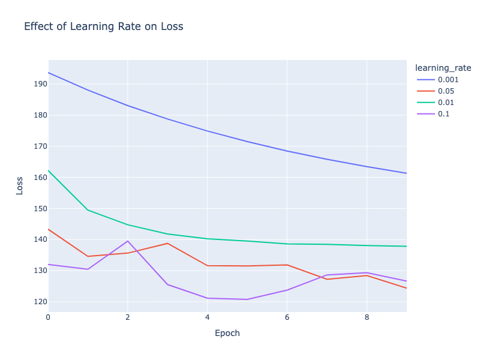

# SMAI Assignment 3 Report

# Multi Layer Perceptron Classification

## Dataset Analysis and Preprocessing

The original dataset used is stored at `data/external/WineQT.csv`

The Id column has been removed as it does not convey any significant information regarding the quality of wine.

Here are the statistics of the dataset:

| Feature | Mean | Std Dev | Min | Max |
| --- | --- | --- | --- | --- |
| Fixed Acidity | 8.311111 | 1.747595 | 4.60000 | 15.90000 |
| Volatile Acidity | 0.531339 | 0.179633 | 0.12000 | 1.58000 |
| Citric Acid | 0.268364 | 0.196686 | 0.00000 | 1.00000 |
| Residual Sugar | 2.532152 | 1.355917 | 0.90000 | 15.50000 |
| Chlorides | 0.086933 | 0.047267 | 0.01200 | 0.61100 |
| Free Sulfur Dioxide | 15.615486 | 10.250486 | 1.00000 | 68.00000 |
| Total Sulfur Dioxide | 45.914698 | 32.782130 | 6.00000 | 289.00000 |
| Density | 0.996730 | 0.001925 | 0.99007 | 1.00369 |
| pH | 3.311015 | 0.156664 | 2.74000 | 4.01000 |
| Sulphates | 0.657708 | 0.170399 | 0.33000 | 2.00000 |
| Alcohol | 10.442111 | 1.082196 | 8.40000 | 14.90000 |
| Quality | 5.657043 | 0.805824 | 3.00000 | 8.00000 |

Here is the distribution of all the features:


The null values have been replaced with the mean value of that column

Linear normalisation has been done for all the columns.

The updated dataset has been stored to `data/processed/WineQT.csv`

## Model Building

The class `MLP_classification_single_label` is a wrapper class around the general MLP class for the task of single label classification. 

Differences from the general class:

Final Layer Activation is Softmax

Loss function is Cross entropy loss

### Sample Run

Here are the model hyper-parameters used in the sample run:

```python
learning_rate=0.1,
activation_function="relu",
optimizer="sgd",
num_hidden_layers=2,
num_neurons=[32, 64], 
epochs=100,
input_layer_size=11, 
output_layer_size=6
```

Here is the output:

```python
Epoch 1/100
Train Cost: 971.6107649690571
Train Accuracy: 0.44638949671772427
Validation Cost: 133.8297227907338
Validation Accuracy: 0.3652173913043478
Epoch 2/100
Train Cost: 945.2524756867779
Train Accuracy: 0.5787746170678337
Validation Cost: 124.9007545136372
Validation Accuracy: 0.46956521739130436
...
Train Cost: 946.1233343814523
Train Accuracy: 0.5973741794310722
Validation Cost: 134.20440163069364
Validation Accuracy: 0.5478260869565217
```

Output of check_gradients()

```python
train -> 3.6857184385245712e-09
val   -> 2.9223781390736292e-09
test  -> 2.1929261534915792e-09
```

## Model Training and Hyper-parameter Tuning

Using Weights & Biases for creating sweeps for the hyper-parameter tuning. 

Each run tracks the cost, accuracy, f1, precision, recall for each epoch on both the training and validation sets.

The sweep tracks the accuracy, f1, precision and recall on the validation set for all the runs.

The combinations tested for this are given by the sweep config:

```python
sweep_config = {
    "method": "grid",
    "metric": {"name": "accuracy", "goal": "maximize"},
    "parameters": {
        "learning_rate": {"values": [0.01, 0.1]},
        "activation_function": {"values": ["relu", "sigmoid", "tanh"]},
        "optimizer": {"values": ["sgd", "batch-gd", "minibatch-gd"]},
        "num_neurons": {
            "values": [
                [32],
                [32, 64],
                [32, 64, 32],
            ]
        },
        "batch_size": {"values": [16, 256]},
        "epochs": {"values": [10, 100]},
    },
}
```

### Trend of Accuracy with change in hyper-parameters


Observations:

- Batch Gradient descent generally leads to lower accuracies and similar results for mini-batch gradient descent with larger batch size.

### Table with all hyper-parameters and all metrics

The table has been stored to `results/single_classification_table_params_metrics.csv` 

The results are sorted by the accuracy in descending order.


### Best Parameters

The following hyper-parameters give the best results (highest accuracy - 63.48%)

```python
activation_function:"tanh"
batch_size:16
epochs:10
learning_rate:0.01
num_neurons:[32]
optimizer:"minibatch-gd"
```

Here are the results of this model:

```python
# Training Metrics
Train Accuracy: 0.5339168490153173
Train Cost: 3923.653800902016
Train F1 Score: 0.5339168490153173
Train Precision: 0.5339168490153173
Train Recall: 0.5339168490153173
# Validation Metrics
Validation Accuracy: 0.6347826086956522
Validation Cost: 386.841595988024
Validation F1 Score: 0.6347826086956522
Validation Precision: 0.6347826086956522
Validation Recall: 0.6347826086956522
# Overalll Metrics
Overall Accuracy: 0.6347826086956522
Overall F1 Score: 0.6347826086956522
Overall Precision: 0.6347826086956522
Overall Recall: 0.6347826086956522

```


The model with the best hyper-parameters and the parameters (weights and biases) has been saved to `results/single_classification_model.json`

## Evaluating Single Label Classification Model

Here are the metrics of running the best model on the test dataset:

```python
Accuracy:  0.6052631578947368
F1 Score:  0.6052631578947368
Precision:  0.6052631578947368
Recall:  0.6052631578947368
```

## Analysing Hyper-parameters Effects

### Effect of non linearity

Here is the plot of the loss vs epochs for the 4 activation functions:


All activation functions lead to similar convergence with slightly different rates.

### Effect of Learning Rate

Here is the plot of the loss vs epochs for 4 different learning rates:



Slow learning rate implies that the loss is not able to reduce drastically, and we observe this with the learning rate as 0.001. This will lead to convergence but too slowly.

With too high of a learning rate, there is a possibility of skipping over the minima to get a higher value instead, which is evident by the up-down spikes for learning rate as 0.1. There is a change of not leading to convergence.

An ideal learning rate is something in the between which neither goes too slow nor too fast around 0.01.

### Effect of Batch Size

Here is the plot of the loss vs epochs for 4 different batch sizes:


Larger batch sizes lead to slower convergence than smaller batch sizes.

## Multi-label Classification

The class `MLP_classification_multi_label` is a wrapper class around the general MLP class for the task of multi label classification. 

Differences from the general class:

Final Layer Activation is Sigmoid

Loss function is Binary Cross entropy loss

### Dataset Processing

The dataset `advertisement.csv` contains all linearly normalised column values

### Sample Run

The model hyper-parameters for the sample run are:

```python
activation_function="relu",
output_layer_size=8,
input_layer_size=10,
optimizer="sgd",
num_hidden_layers=3,
num_neurons=[32, 64, 32],
learning_rate=0.01,
epochs=100,
```

### Hyper-parameter tuning

The config used for the sweep is:

```python
sweep_config = {
    "method": "grid",
    "metric": {"name": "accuracy", "goal": "maximize"},
    "parameters": {
        "learning_rate": {"values": [0.01, 0.1]},
        "activation_function": {"values": ["relu", "sigmoid", "tanh"]},
        "optimizer": {"values": ["sgd", "batch-gd", "minibatch-gd"]},
        "num_neurons": {
            "values": [
                [32],
                [32, 64],
                [32, 64, 32],
            ]
        },
        "batch_size": {"values": [16, 256]},
        "epochs": {"values": [10, 100]},
    },
}
```

Plot of parameters vs accuracy:


Table of parameters with their results:


The entire table has been stored to `results/multi_classification_table_params_metrics.csv` 

Best Model Hyper-parameters (52.25% accuracy):

```python
activation_function:"relu"
batch_size:256
epochs:100
learning_rate:0.01
num_neurons:[32,64]
optimizer:"batch-gd"
```

The model with the best hyper-parameters and the parameters (weights and biases) has been saved to `results/multi_classification_model.json`

Results on test set:

```python
Accuracy:  0.46375
F1 Score:  0.48499399759903966
Precision:  0.3594306049822064
Recall:  0.7453874538745388
Hamming Loss:  0.53625
```

## Analysis

### Single Label Classification on WineQT

Given that the true labels are in the range 0-5, the predicted labels are always in the range of 2-3. 


This implies that the model has almost learnt to predict classes 2 and 3 with the respective probabilities and the rest of the classes are almost like outliers which are never predicted by the model. This is due to the uneven distribution in the original dataset as it is not stratified. This causes the model to predict based on the distribution of the classes rather than the data itself.

### Multi Label Classification on Advertisements

Here is the plot of the distribution of the true and predicted classes:


This indicates a stratified split, therefore the model is not biased towards any class solely based on popularity. 

Here is the confusion matrix for this:


The model's performance is relatively consistent across most classes, with the exception of class 5 which shows lower values overall. The "Predicted 1" column shows consistently lower values across all true classes compared to other predictions. This suggests the model is under-predicting class 1 consistently.

# Multilayer Perceptron Regression

## Dataset Preprocessing

The original dataset used is stored at `data/external/HousingData.csv`

Here are the statistics of the dataset:

| Feature | Mean | Std Dev | Min | Max |
| --- | --- | --- | --- | --- |
| CRIM | 3.611874 | 8.720192 | 0.00632 | 88.9762 |
| ZN | 11.211934 | 23.388876 | 0.00000 | 100.0000 |
| INDUS | 11.083992 | 6.835896 | 0.46000 | 27.7400 |
| CHAS | 0.069959 | 0.255340 | 0.00000 | 1.0000 |
| NOX | 0.554695 | 0.115878 | 0.38500 | 0.8710 |
| RM | 6.284634 | 0.702617 | 3.56100 | 8.7800 |
| AGE | 68.518519 | 27.999513 | 2.90000 | 100.0000 |
| DIS | 3.795043 | 2.105710 | 1.12960 | 12.1265 |
| RAD | 9.549407 | 8.707259 | 1.00000 | 24.0000 |
| TAX | 408.237154 | 168.537116 | 187.00000 | 711.0000 |
| PTRATIO | 18.455534 | 2.164946 | 12.60000 | 22.0000 |
| B | 356.674032 | 91.294864 | 0.32000 | 396.9000 |
| LSTAT | 12.715432 | 7.155871 | 1.73000 | 37.9700 |
| MEDV | 22.532806 | 9.197104 | 5.00000 | 50.0000 |

Here is the distribution of all the features:


The `split_data()` function has been used to split the data in all the following tasks.

Here is the output of data.info():

```python

RangeIndex: 506 entries, 0 to 505
Data columns (total 14 columns):
 #   Column   Non-Null Count  Dtype  
---  ------   --------------  -----  
 0   CRIM     486 non-null    float64
 1   ZN       486 non-null    float64
 2   INDUS    486 non-null    float64
 3   CHAS     486 non-null    float64
 4   NOX      506 non-null    float64
 5   RM       506 non-null    float64
 6   AGE      486 non-null    float64
 7   DIS      506 non-null    float64
 8   RAD      506 non-null    int64  
 9   TAX      506 non-null    int64  
 10  PTRATIO  506 non-null    float64
 11  B        506 non-null    float64
 12  LSTAT    486 non-null    float64
 13  MEDV     506 non-null    float64
dtypes: float64(12), int64(2)
```

There are null values present in the dataset and have been replaced with the mean value of that column

Linear normalisation has been done for all the columns.

The updated dataset has been stored to `data/processed/HousingData.csv`

## Model Building

The class `MLP_regression` is a wrapper class around the general MLP class for the task of regression. 

Differences from the general class:

Final Layer Activation is Linear.

Loss function is Mean Square Error

### Sample Run

Here are the model hyper-parameters for the sample run:

```python
learning_rate=0.01,
activation_function="relu",
optimizer="batch-gd",
num_hidden_layers=2,
num_neurons=[32, 64],
input_layer_size=13,
output_layer_size=1,
batch_size=256
epochs=100
```

Here is the output:

```python
Epoch 1/100
Train Cost: 0.1742409251353387
Train MSE: 0.1742409251353387
Validation Cost: 0.1380766515379453
Validation MSE: 0.1380766515379453
Epoch 2/100
Train Cost: 0.163616836478172
Train MSE: 0.163616836478172
Validation Cost: 0.12828674531949513
Validation MSE: 0.12828674531949513
...
Train Cost: 0.03465686832733662
Train MSE: 0.03465686832733662
Validation Cost: 0.02082282180566431
Validation MSE: 0.02082282180566431

```

## Model Training and Hyper-parameter Tuning

Using Weights & Biases for creating sweeps for the hyper-parameter tuning. 

Each run tracks the cost, MSE, RMSE and r2 for each epoch on both the training and validation sets.

The sweep tracks the MSE, RMSE and r2 on the validation set for all the runs.

The combinations tested for this are given by the sweep config:

```python
sweep_config = {
    "method": "grid",
    "metric": {"name": "mse", "goal": "minimize"},
    "parameters": {
        "learning_rate": {"values": [0.01, 0.1]},
        "activation_function": {"values": ["relu", "sigmoid", "tanh"]},
        "optimizer": {"values": ["sgd", "batch-gd", "minibatch-gd"]},
        "num_neurons": {
            "values": [
                [32],
                [32, 64],
                [32, 64, 32],
            ]
        },
        "batch_size": {"values": [16, 256]},
        "epochs": {"values": [10, 100]},
    },
}
```

### Trend of MSE with change in hyper-parameters


### Table with all hyper-parameters and all metrics

The table has been stored to `results/regression_table_params_metrics.csv` 

The results are sorted by the MSE in ascending order.


### Best parameters

The following hyper-parameters give the best results (lowest MSE 0.01 and highest R2 0.7)

```python
activation_function:"relu"
batch_size:256
epochs:100
learning_rate:0.1
num_neurons:[32, 64]
optimizer:"sgd"
```

Here are the results of this model:

```python
# Train Results
Train_cost: 0.005103945805405139
Train_mse: 0.005103945805405139
Train_r2: 0.881404000748569
Train_rmse: 0.07144190510761271
# Validation Results
Validation_cost: 0.010032149844085122
Validation_mse: 0.010032149844085122
Validation_r2: 0.7024191096162542
Validation_rmse: 0.10016062022614038
# Overall Metrics
mse: 0.010032149844085122
r2: 0.7024191096162542
rmse: 0.10016062022614038
```


The model with the best hyper-parameters and the parameters (weights and biases) has been saved to `results/regression_model.json`

## Evaluating Regression Model

Here are the metrics of running the best model on the test dataset:

```python
MSE: 0.010700044809312852
RMSE: 0.10344102092164816
R2: 0.7725149111286014
MAE: 0.0608259246459703
```

## Mean Squared Error vs Binary Cross Entropy

### Diabetes Dataset Processing

The null values have been replaced with the mean value of that column

Linear normalisation has been done for all the columns.

The updated dataset has been stored to `data/processed/diabetes.csv`

### Model Changes

Two additional conditions have been added based on the requirements - 

1. Logistic Regression with sigmoid output and BCE loss
2. Logistic Regression with sigmoid output and MSE loss

### Output

The parameters on which the models are run are:

```python
learning_rate=0.01,
activation_function="relu",
optimizer="batch-gd",
num_hidden_layers=2,
num_neurons=[32, 64],
epochs=100,
```

Here is the output of the two functions:

```python
Model 1 BCE
MSE: 0.24613894453814575
RMSE: 0.4961239205462137
R2: -0.03021633597994966
MAE: 0.4906257155207501
Model 2 MSE
MSE: 0.2525194867719552
RMSE: 0.5025131707447629
R2: -0.056922141735372245
MAE: 0.5018598454644987
```

### Plot of Loss vs Epochs for both models


### Observations

- The BCE loss decreases steadily and seems to have a smoother curve compared to the MSE plot. It has an exponential decay pattern, indicating that the loss is reducing faster at the beginning and slows down as it approaches the lower bound.
- The MSE loss decreases linearly with a uniform rate.
- BCE appears to converge faster at the beginning whereas MSE has a gradual convergence

## Analysis

Here is the plot of the MSE and Ytrue values for the HousingData.csv dataset:


The MSE is fairly consistently low with few spikes based on the testY value. Especially, when the true y value is 1, the MSE has spikes implying that these points are being treated as outliers. 

# General MLP Class Implementation

Hyperparameters:

**Learning Rate**: default is 0.1

**Activation Function**: Options are ReLU, Sigmoid, Tanh, Linear

**Optimisers**: Options are SGD, Mini-batch GD and Batch GD

**Number of hidden layers with neurons per layer**

**Batch Size** for Mini batch GD

Number of **epochs**

The **task** to be performed by the MLP. This affects the loss function and the output activation function.

Difference in model based on tasks:

| Task | Output Activation Function  | Loss Function |
| --- | --- | --- |
| Single Label Classification | Softmax | Cross Entropy Loss |
| Multi Label Classification | Sigmoid | Binary Cross Entropy |
| Regression | Linear | Mean Square Error |

The `check_gradient()` function compares the analytical and numerical gradients to ensure correctness. 

# Autoencoders

## Implementation Details

The existing MLP Regression class is used for implementing the autoencoder. Input and Reduced dimensions are taken as parameters and the autoencoder uses a MLP network of input - hidden - reduced - hidden_reversed - output neurons where input and output have the same number of neurons.

The initialisation method sets up this architecture based on the inputs.

The fit method calls the MLP fit method with both X and y values as X.

The get_latent method returns the values in the reduced layer after activation.

## Dataset processing

The processed Spotify dataset stored at `data/processed/spotify.csv` is used for this task. All the columns are linearly normalised to the range 0-1.

The original dataset contains 11 dimensions for each datapoint. 

Based on Assignment 2, the optimal reduced dimension using PCA was 6.

Thus, the autoencoder model should reduce the dimension from 11 to 6 and reconstruct it back to 11 dimensions.

## Training the Autoencoder

Here are the hyper-parameters used for the training of the autoencoder:

```python
input_dim=11,
reduced_dims=6,
num_hidden_layers=2,
num_neurons=[8, 8],
batch_size=256,
epochs=50,
activation_function='sigmoid',
optimizer='minibatch-gd', 
earning_rate=0.1)
```

The autoencoder model has the following number of neurons:

```python
(input) 11 -> 8 -> 8 -> 6 (reduced) -> 8 -> 8 -> 11 (reconstruction)
```

The autoencoder training is done by calling the .fit() function on trainX which uses the regression MLP to minimise the MSE of the reconstruction error. This changes the activation values at each layer and the middle layer can be extracted to get the reduced dataset.

Here is the output of the training process:

```python
model.fit(trainX)

Epoch 1/50
Train Cost: 0.09814067593661843
Train MSE: 0.09814067593661843
Epoch 2/50
Train Cost: 0.07586871014755696
Train MSE: 0.07586871014755696
Epoch 3/50
Train Cost: 0.07289278395785077
Train MSE: 0.07289278395785077
...
Epoch 49/50
Train Cost: 0.07241572455621392
Train MSE: 0.07241572455621392
Epoch 50/50
Train Cost: 0.07241577108124893
Train MSE: 0.07241577108124893
```

The reconstruction loss reduces from 0.098 to 0.072 in the training step.

## Autoencoder + KNN

All the X datasets (train, test and val) are passed through the autoencoder to get the reduced dimensional datasets.

The best KNN hyper-parameters obtained in Assignment 1 are:

```python
metric:'Manhattan'
k=28
```

The KNN model has been fit on the reduced trainX and trainY datasets. Here are the results on the various evaluation sets:

```python
# Training set metrics
Accuracy: 0.25342105263157894
Precision: 0.25342105263157894
Recall: 0.25342105263157894
F1 Score: 0.25342105263157894

# Validation set metrics
Accuracy: 0.1812280701754386
Precision: 0.1812280701754386
Recall: 0.1812280701754386
F1 Score: 0.1812280701754386

# Test set metrics
Accuracy: 0.18043859649122806
Precision: 0.18043859649122806
Recall: 0.18043859649122806
F1 Score: 0.18043859649122806

Inference time: 15.433241844177246
```

### Comparison with previous methods

|  | Original Dataset | Reduced Dataset (PCA) | Reduced Dataset (Autoencoder) |
| --- | --- | --- | --- |
| Accuracy | 0.2326 | 0.2032 | 0.1804 |
| Precision | 0.2326 | 0.2032 | 0.1804 |
| Recall | 0.2326 | 0.2032 | 0.1804 |
| F1 | 0.2326 | 0.2032 | 0.1804 |
| Inference Time | 23s | 15s | 15s |

The results are vey similar to the original methods with slightly worse accuracy. The accuracy reduces slightly with the reduced dimensions as expected as we are losing some information compared to the original. However, the loss in information is not significant as both PCA and Autoencoder aim to reduce the reconstruction error. The advantage of dimensionality reduction is faster inference. Comparing PCA and auto-encoders as both reduce the dataset to 6 dimensions, PCA does a better job of retaining more information thus giving better slightly better accuracy.

## MLP Classification

Dataset: Processed spotify.csv with all columns linearly normalised to the range 0-1 with track_genre being hash encoded.

The track_genres are converted to one hot encoding to serve as the output of the MLP model.

The hyper-parameters used in this task are:

```python
learning_rate=0.1,
activation_function='tanh',
optimizer='minibatch-gd',
batch_size=256,
epochs=50,
num_hidden_layers=3,
num_neurons=[16, 32, 64]
```

Here is the training output (with early stopping):

```python
Epoch 1/50
Train Cost: 386300.89513498795
Train Accuracy: 0.06042763157894737
Validation Cost: 48262.49436497198
Validation Accuracy: 0.058070175438596494
Epoch 2/50
Train Cost: 363476.13705471513
Train Accuracy: 0.10225877192982456
Validation Cost: 45403.588273643865
Validation Accuracy: 0.1118421052631579
...
Epoch 33/50
Train Cost: 271666.6109626296
Train Accuracy: 0.23330043859649122
Validation Cost: 34141.18965349187
Validation Accuracy: 0.23140350877192983
Epoch 34/50
Train Cost: 270621.88405459374
Train Accuracy: 0.24141447368421054
Validation Cost: 34017.77338221167
Validation Accuracy: 0.23692982456140352
```

Results on the test dataset:

```python
Test Set Metrics:
Accuracy:  0.24359649122807017
Precision:  0.24359649122807017
Recall:  0.24359649122807017
F1 Score:  0.24359649122807017
```

### Comparison

The accuracy is 24% on the entire dataset when using MLP for classification. Using KNN on the entire processed dataset, the accuracy was 23%, implying MLP does a better job in single label classification compared to KNN. The accuracy difference is very small but the overall training + inference time is lesser in MLP compared to KNN.