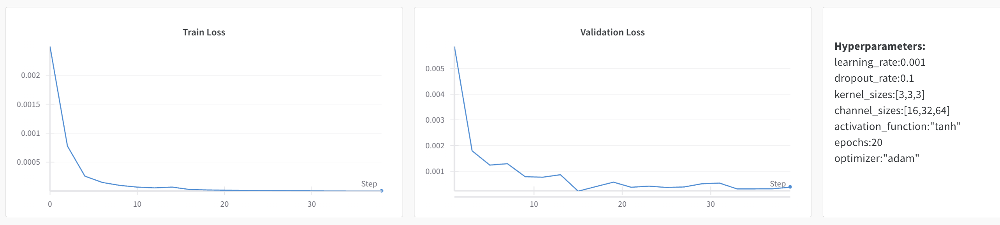
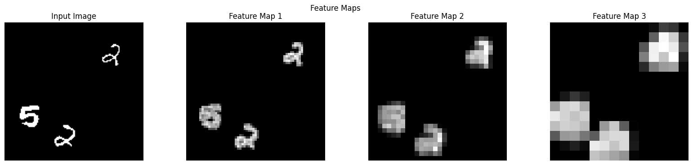

# SMAI Assignment 4 Report

# Classification using CNN

CNN to predict the number of digits in a given image using both classification and regression approaches.

## Dataset Loading and Preprocessing

Raw dataset stored at `data/external/double_mnist`

The `load_mnist_data()` function extracts images from the dataset folders and organises into separate tensors for images and labels for train, val, and test sets

The `MultiMNISTDataset` class inherits the `torch.utils.data.Dataset` class which are used to create the dataset instances to be used by the dataloaders.

The `get_dataloaders()` function is used as a wrapper function to read the dataset, create instances of the dataset class and then return the appropriate dataloaders based on the task.

## CNN Class Implementation

The class has been written in `models/cnn/cnn.py` which takes in the following hyper-parameters with their default values:

```python
learning_rate=0.01,
dropout_rate=0.5,
kernel_sizes=[3,3,3],
channel_sizes=[32, 64, 128],
activation_functions=[nn.ReLU(), nn.ReLU(), nn.ReLU()],
input_channels=1,
input_size=128, # assuming square images
output_size=1,
epochs=10,
optimizer=optim.Adam,
task="classification", # options: 'regression', 'multilabel-classification'
log_wandb=False
```

The task determines the criteria on which the model is optimised. Here are the options:

```python
Binary Classification -> nn.BCELoss()
Multi Class/Label Classification -> nn.CrossEntropyLoss()
Regression -> nn.MSELoss()
```

The entire model is also moved to the available compute device - either `mps`, `cuda` or `cpu`

The model architecture is composed of a series of Convolution → Activation → Pool layers. Finally a dropout layer with two fully connected layers with an activation function is applied. 

## Sample Run of the model

- Regression
    
    ```python
    Using device: cuda
    100%|██████████| 197/197 [00:01<00:00, 111.46it/s]
    Epoch 1/5, Loss: 0.24177937505549282
    	Validation Loss: 0.0252 Validation Accuracy: 99.77% 
    100%|██████████| 197/197 [00:01<00:00, 121.81it/s]
    Epoch 2/5, Loss: 0.031116546344409135
    	Validation Loss: 0.0188 Validation Accuracy: 99.90% 
    100%|██████████| 197/197 [00:01<00:00, 121.47it/s]
    Epoch 3/5, Loss: 0.024527723087839366
    	Validation Loss: 0.0143 Validation Accuracy: 99.90% 
    100%|██████████| 197/197 [00:01<00:00, 120.70it/s]
    Epoch 4/5, Loss: 0.019563518100545792
    	Validation Loss: 0.0138 Validation Accuracy: 99.93% 
    100%|██████████| 197/197 [00:01<00:00, 120.14it/s]
    Epoch 5/5, Loss: 0.018905764214013736
    	Validation Loss: 0.0101 Validation Accuracy: 99.93% 
    	Train Loss: 0.0086 Train Accuracy: 100.00% 
    	Validation Loss: 0.0101 Validation Accuracy: 99.93% 
    	Test Loss: 0.0085 Test Accuracy: 100.00% 
    ```
    
- Classification
    
    ```python
    Using device: cuda
    100%|██████████| 197/197 [00:01<00:00, 121.02it/s]
    Epoch 1/5, Loss: 0.6249356365320627
    	Validation Loss: 0.0061 Validation Accuracy: 99.87% 
    100%|██████████| 197/197 [00:01<00:00, 120.68it/s]
    Epoch 2/5, Loss: 0.007901927607715986
    	Validation Loss: 0.0007 Validation Accuracy: 100.00% 
    100%|██████████| 197/197 [00:01<00:00, 120.24it/s]
    Epoch 3/5, Loss: 0.0067588097396804325
    	Validation Loss: 0.0003 Validation Accuracy: 100.00% 
    100%|██████████| 197/197 [00:01<00:00, 119.93it/s]
    Epoch 4/5, Loss: 0.008972848703945319
    	Validation Loss: 0.0020 Validation Accuracy: 99.97% 
    100%|██████████| 197/197 [00:01<00:00, 120.53it/s]
    Epoch 5/5, Loss: 0.0123850000191357
    	Validation Loss: 0.0003 Validation Accuracy: 100.00% 
    	Train Loss: 0.0003 Train Accuracy: 100.00% 
    	Validation Loss: 0.0003 Validation Accuracy: 100.00% 
    	Test Loss: 0.0002 Test Accuracy: 100.00% 
    ```
    

## Hyperparameter Tuning

Here is the sweep configs for hyper-parameter tuning for both classification and regression tasks:

```python
sweep_config = {
    "method": "grid",
    "metric": {"name": "accuracy", "goal": "maximize"},
    "parameters": {
        "learning_rate": {"values": [0.01, 0.001]},
        "dropout_rate": {"values": [0.1, 0.5, 0.9]},
        "num_layers": {"values": [1, 3, 5]},
        "activation_function": {"values": ["relu", "sigmoid", "tanh"]},
        "optimizer": {"values": ["adam", "sgd"]},
        "epochs": {"values": [10, 20]},
    },
}
```

### Regression Analysis


### Best CNN Regression Model

```python
activation_function:"tanh"
dropout_rate:0.1
epochs:20
learning_rate:0.001
kernel_sizes:[3,3,3]
channel_sizes:[16,32,64]
optimizer:"adam"
```

Results:


```python
Train Loss: 0.0028449
Train Accuracy: 100%
Val Loss: 0.0039507
Val Accuracy: 100%
Test Loss: 0.0042344
Test Accuracy: 100%
```

### Classification Analysis




### Best CNN Classification Model

```python
activation_function:"relu"
dropout_rate:0.1
epochs:20
learning_rate:0.01
kernel_sizes:[3,3,3]
channel_sizes:[16,32,64]
optimizer:"adam"
```

Results:


```python
Train Loss: 3.2550e-7
Train Accuracy: 100%
Val Loss: 5.4337e-7
Val Accuracy: 100%
Test Loss: 0.000001017
Test Accuracy: 100%
```

## Feature Map Visualisation

Regression Model:




Classification Model:


Inferences:

- Each convolutional block blurs the image marking them as distinct digits. The blurring increases as the number of channel increases
- The blurring is independent on the digit itself. It is only concerned with the presence of continuous white pixels in a region.

# Multi Label Classification

Model to predict the exact digits present in the image while preserving the sequence of digits.

## Data Loading and Preprocessing

The dataset remains the same as the last task. The only preprocessing change here is to map each image to a 33 bit one hot encoded vector. Each 11 digits represent one out of the three digits in the label. The indices 0-9 represent the presence of the respective digit, whereas the index 10 represents the absence of a digit.

## Model Implementation

The model has been implemented in the CNN class directly by passing in a new task parameter = *multilabel-classification*

There is no role of any activation function in the last layer. Since we are only concerned with taking the argmax of the outputs, and all activation functions maintain the relative ordering of the output neurons, there is no need for any activation function at the output.

### Sample Run

The model is given as:

```python
CNN(task="multilabel-classification", epochs=15, learning_rate=0.001, output_size=33)
```

Output:

```python
Using device: cuda
100%|██████████| 197/197 [00:01<00:00, 120.74it/s]
Epoch 1/15, Loss: 8.398880411525669
	Validation Loss: 8.3448 Validation Accuracy: 3.57% Hamming Accuracy: 38.60%
100%|██████████| 197/197 [00:01<00:00, 121.51it/s]
Epoch 2/15, Loss: 7.837298245599428
	Validation Loss: 8.2864 Validation Accuracy: 4.03% Hamming Accuracy: 42.83%
100%|██████████| 197/197 [00:01<00:00, 121.43it/s]
Epoch 3/15, Loss: 7.556703894271464
	Validation Loss: 8.3454 Validation Accuracy: 3.80% Hamming Accuracy: 44.89%
	...
100%|██████████| 197/197 [00:01<00:00, 120.35it/s]
Epoch 14/15, Loss: 5.21986215126696
	Validation Loss: 6.4557 Validation Accuracy: 32.50% Hamming Accuracy: 73.06%
100%|██████████| 197/197 [00:01<00:00, 121.09it/s]
Epoch 15/15, Loss: 5.181299412916155
	Validation Loss: 6.4693 Validation Accuracy: 33.83% Hamming Accuracy: 73.46%
	Train Loss: 4.8353 Train Accuracy: 73.93% Hamming Accuracy: 88.99%
	Validation Loss: 6.4697 Validation Accuracy: 33.83% Hamming Accuracy: 73.46%
	Test Loss: 7.2534 Test Accuracy: 28.67% Hamming Accuracy: 72.12%
```

## Hyperparameter Tuning

Here is the sweep configs for hyper-parameter tuning:

```python
sweep_config = {
    "method": "grid",
    "metric": {"name": "hamming_accuracy", "goal": "maximize"},
    "parameters": {
        "learning_rate": {"values": [0.01, 0.001]},
        "dropout_rate": {"values": [0.1, 0.5, 0.9]},
        "num_layers": {"values": [1, 3, 5]},
        "activation_function": {"values": ["relu", "sigmoid", "tanh"]},
        "optimizer": {"values": ["adam", "sgd"]},
        "epochs": {"values": [10, 20]},
    },
}
```

### Loss Graphs


### Best Model

Hyperparameters:

```python
activation_function:"relu"
dropout_rate:0.1
epochs:20
learning_rate:0.001
kernel_sizes:[3,3,3,3,3]
channel_sizes:[16,32,64,128,32]
optimizer:"adam"
```

Results:


```python
Train Loss: 6.05853
Train Exact Match Accuracy: 31.52381%
Train Hamming Accuracy: 66.13492%
Val Loss: 7.08152
Val Exact Match Accuracy: 8.86667%
Val Hamming Accuracy: 52.65556%
Test Loss: 7.52343
Test Exact Match Accuracy: 4.93478%
Test Hamming Accuracy: 55.11594%
```

# AutoEncoders - Comparative Analysis

Encoder - Compress data to a low dimensional latent space

Decoder - Reconstructs original data from the reduced latent space

## Dataset Loading and Preprocessing

Raw dataset stored at `data/external/fashion_mnist/`

Split into appropriate train-val-test and stored to `data/processed/fashion_mnist`.

### Visualising Images


Guesses:

```python
1. Sweatshirt
2. Shoe
3. Shirt
4. T-Shirt
5. Dress
```

Actual labels:

| 0 | 1 | 2 | 3 | 4 | 5 | 6 | 7 | 8 | 9 |
| --- | --- | --- | --- | --- | --- | --- | --- | --- | --- |
| T-Shirt | Trouser | Pullover | Dress | Coat | Sandal | Shirt | Sneaker | Bag | Ankle Boot |

## CNN AutoEncoder

### Model Implementation

The model class `CNNAutoencoder` has been implemented in `models/AutoEncoder/cnn_autoencoder.py`

Default Hyperparameters:

```python
learning_rate=0.01,
kernel_sizes=[3, 5],
channel_sizes=[16, 32],
activation_functions=[nn.Sigmoid(), nn.Sigmoid()],
input_channels=1,
input_size=28,
epochs=10,
optimizer=optim.Adam,
log_wandb=False,
```

### Sample Run of CNN Encoder

```python
Using device: cuda
Epoch: 1/10, Train Loss: 0.053676145934902345
	Validation Loss: 0.02774359249053108
Epoch: 2/10, Train Loss: 0.02514065257118791
	Validation Loss: 0.023801512292521015
Epoch: 3/10, Train Loss: 0.022481982200823324
	Validation Loss: 0.021333283276125124
Epoch: 4/10, Train Loss: 0.020664994642995965
	Validation Loss: 0.020133739455964913
Epoch: 5/10, Train Loss: 0.01963124183170936
	Validation Loss: 0.01988840289413929
Epoch: 6/10, Train Loss: 0.018957928549545956
	Validation Loss: 0.018580256243515166
Epoch: 7/10, Train Loss: 0.01853271440633804
	Validation Loss: 0.018574606734001714
Epoch: 8/10, Train Loss: 0.01827175349301999
	Validation Loss: 0.018298395375489808
Epoch: 9/10, Train Loss: 0.018073445879151603
	Validation Loss: 0.024186103919129464
Epoch: 10/10, Train Loss: 0.01794610610303214
	Validation Loss: 0.01782679144933725
```

### Original and Reconstructed Images


### Plot of Encoded Representations
|||
|-|-|

Observations:

- The classes are decently well separated from one another.
- Labels 0 and 2 (TShirt and Pullover) seem to be overlapping which is expected. Label 4 is also slightly overlapping with the these classes.

### Hyperparameter Tuning

Here is the sweep config used for the hyper-parameter tuning:

```python
sweep_config = {
    "method": "grid",
    "metric": {"name": "loss", "goal": "minimize"},
    "parameters": {
        "learning_rate": {"values": [0.01, 0.001]},
        "kernel_sizes": {"values": [[3], [5], [3, 3], [3, 3, 3], [3, 5], [3, 5, 7]]},
        "activation_function": {"values": ["relu", "sigmoid", "tanh"]},
        "optimizer": {"values": ["adam", "sgd"]},
        "epochs": {"values": [10, 20]},
    },
}
```

Here is the plot of how the hyperparamters contribute to the loss:


### Loss graphs for different hyperparameters

1. Best Performing Model
    
    
    
2. Average Performing Model
    
    
    
3. Worst Performing Model
    
    
    

### Best Model

Hyper-params:

```python
learning_rate:0.001
kernel_sizes:[3]
channel_sizes: [16]
activation_function:"tanh"
epochs:20
optimizer:"adam"
```

### Effect of Number of Layers

Learning rate, activation function, epochs and optimiser have been kept fixed as that of the best model hyper-parameters. The kernel size is 3 for all the layers that are present. Here is the table summarising the results:

| No of layers | Train Loss | Validation Loss |
| --- | --- | --- |
| 1 | 0.015729 | 0.015841 |
| 2 | 0.016734 | 0.016822 |
| 3 | 0.017519 | 0.017683 |

Here are the loss plots for these runs:

1. 1 layer
    
    
    
2. 2 layers
    
    
    
3. 3 layers
    
    
    

Observations:

- Lesser layers performs better (minimal loss) as the reduced dimension remains higher allowing easier reconstruction without much loss in information.

## MLP AutoEncoder

Using the MLP AutoEncoder made in Assignment 3. Model is stored in `models/AutoEncoders/AutoEncoder.py` with class `AutoEncoder_MLP`

### Sample Run

Hyperparameters:

```python
epochs=10
learning_rate=0.001
input_dim=784
reduced_dims=49
num_neurons=[512, 256, 128]
num_hidden_layers=3
activation_function="tanh"
optimizer="minibatch-gd"
log_local=True
```

Output of training:

```python
Epoch 1/10
Train Cost: 0.0673037970434429
Train MSE: 0.0673037970434429
Validation Cost: 0.06776780080137478
Validation MSE: 0.06776780080137478
Epoch 2/10
Train Cost: 0.05310961317317604
Train MSE: 0.05310961317317604
Validation Cost: 0.053504094071073
Validation MSE: 0.053504094071073
Epoch 3/10
Train Cost: 0.04716829756573617
Train MSE: 0.04716829756573617
Validation Cost: 0.04753641548653968
Validation MSE: 0.04753641548653968
...
Epoch 10/10
Train Cost: 0.03290426806043161
Train MSE: 0.03290426806043161
Validation Cost: 0.033141127868769424
Validation MSE: 0.033141127868769424

```

### Loss Curve over epochs


Both the loss values run very close to each other. They both reduce at a steady rate.

Comparing with the CNN model:

- The final loss value is MLP is much higher than the CNN model implying that CNN based auto-encoder does a better job in compressing and reconstructing images

### Original and Reconstructed Images


The reconstructed images are not very good compared to the CNN. This is a result of the loss value being higher that the CNN auto-encoder. This model seems to spatially retain the type of clothing but not the exact details precisely.

## PCA AutoEncoder

The class `PCA_AutoEncoder` has been implemented in `models/AutoEncoder/pca_autoencoder.py`

### Sample Runs

Here is the result of the final reconstruction loss with the number of components in the latent dimension:

```python
Num Components: 12, MSE: 0.022879013791680336
Num Components: 62, MSE: 0.010600248351693153
Num Components: 112, MSE: 0.0070479377172887325
Num Components: 162, MSE: 0.005109797231853008
Num Components: 212, MSE: 0.0038229702040553093
Num Components: 262, MSE: 0.002895406214520335
Num Components: 312, MSE: 0.002197324763983488
Num Components: 362, MSE: 0.0016537681221961975
Num Components: 412, MSE: 0.001223245752044022
Num Components: 462, MSE: 0.0008819521754048765
Num Components: 512, MSE: 0.0006111843977123499
Num Components: 562, MSE: 0.0003986787050962448
Num Components: 612, MSE: 0.00023652511299587786
Num Components: 662, MSE: 0.00011521179840201512
Num Components: 712, MSE: 3.628264312283136e-05
Num Components: 762, MSE: 2.0197301182633964e-06
```

As the components increases, the MSE reduces significantly as less information is being lost.

### Optimal Number of Components

Here is the plot of MSE vs the number of components:


Based on the graph, the elbow point seems to be at 10 components.

**$k_{optimal} = 10$**

The value of k_optimal seems to be around the range of 8-12.

### Original and Reconstructed Images


The quality of reconstruction is almost similar to that of CNN and definitely better than MLP. This seems to retain more of the shape and object details compared to the finer design or texture details which the CNN learns. 

## KNN Classification

In this case, k_optimal is considered to be 9 (instead of 10) as it would be easier to represent as a square image of size 3x3 for the convolutional autoencoder.

Using the following parameters:

```python
k_optimal = 9
# best peforming KNN model from Assignment 1
KNN(k=28, metric='manhattan')
```

### Getting the latent vectors

Here are the model parameters for obtaining the latent vectors:

1. CNN Autoencoder
    
    ```python
    CNNAutoencoder(epochs=10, kernel_sizes=[3,3,3], channel_sizes=[16,32,1], activation_functions=[nn.Sigmoid(), nn.Sigmoid(), nn.Sigmoid()])
    ```
    
2. MLP Autoencoder
    
    ```python
    AutoEncoder_MLP(epochs=10, learning_rate=0.001, input_dim=784, reduced_dims=9, num_neurons=[512, 128, 64], num_hidden_layers=3, activation_function="tanh",optimizer="minibatch-gd", log_local=True)
    ```
    
3. PCA Autoencoder
    
    ```python
    PCA_AutoEncoder(hidden_size=9)
    ```
    

### Performance Comparison

Here are the accuracies of the KNN model based on the three encoders:

```python
Train Accuracy CNN: 80.262%
Train Accuracy MLP: 78.464%
Train Accuracy PCA: 81.806%
Test Accuracy CNN: 78.55%
Test Accuracy MLP: 76.85%
Test Accuracy PCA: 80.60%
```


The accuracies are good for all the 3 encoded representations. PCA still does slightly better than CNN, which does slightly better than MLP.

### Confusion Matrices


Observations:

- Similar performance is given by the three models for all the classes.
- The main diagonal consists of high values implying high accuracy of predicting the right category.
- Shirt and T-Shirt have slightly high value compared the other non diagonal elements. This logically makes sense as sometimes similar clothing may be hard to distinguish among these both.
- Another such relation is Pullover and Coat.