# SMAI Assignment 5 Report

# Kernel Density Estimation (KDE)

KDE class has been implemented in `models/KDE/KDE.py`

The hyper-parameters of the model are the kernel type and bandwidth.

## Synthetic Data Generation

The function `generate_random_circle(*center*, *radius*, *num_points*)` samples points uniformly on a circle and adds random gaussian noise along the x and y.

Here is the data generated using the function:

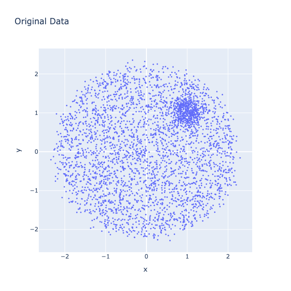

## Results

Here are the plots for various hyper-parameter combinations:

|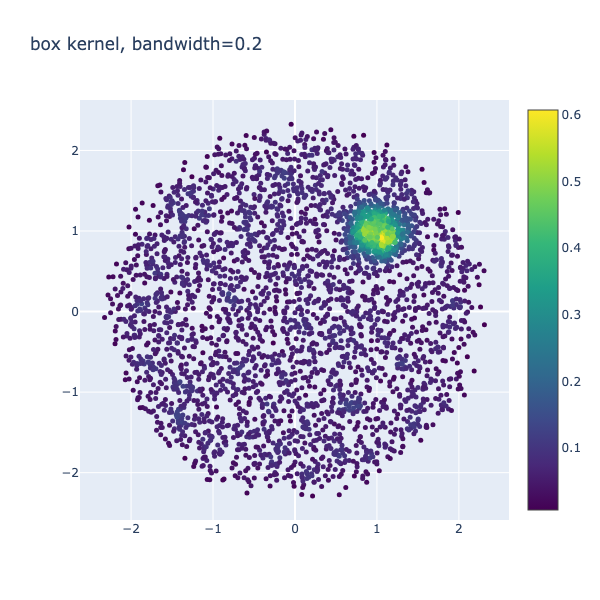|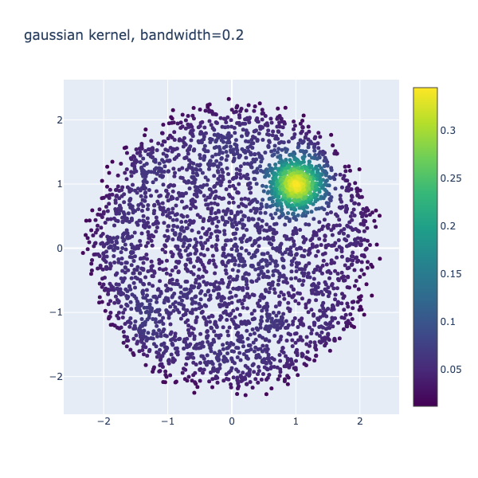|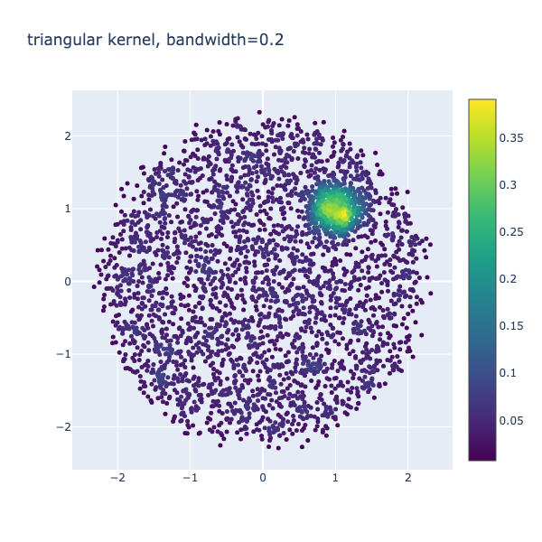|
|-|-|-|
|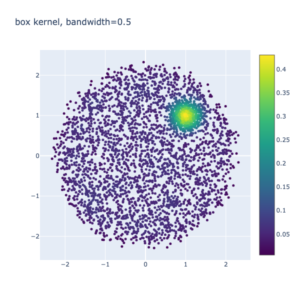|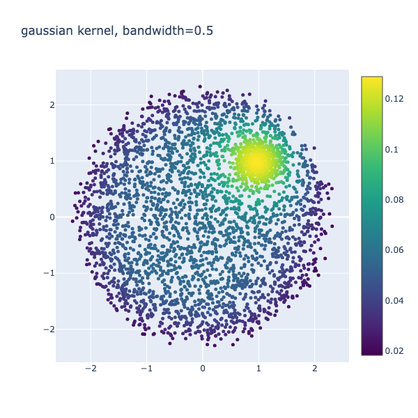|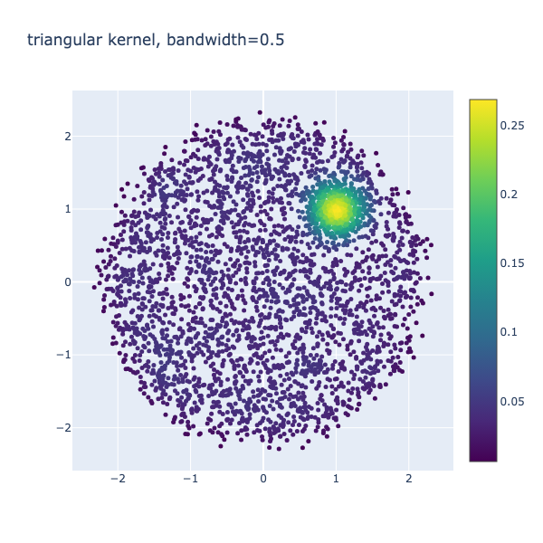|
|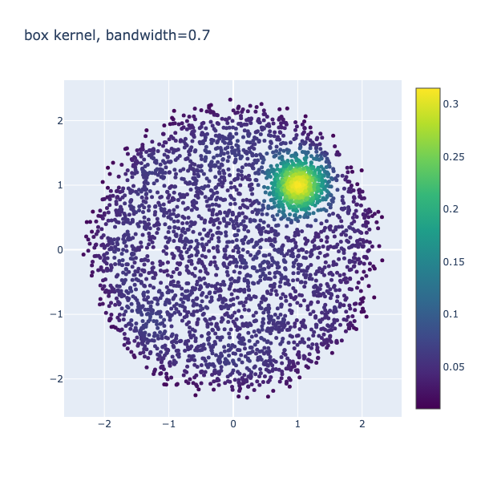|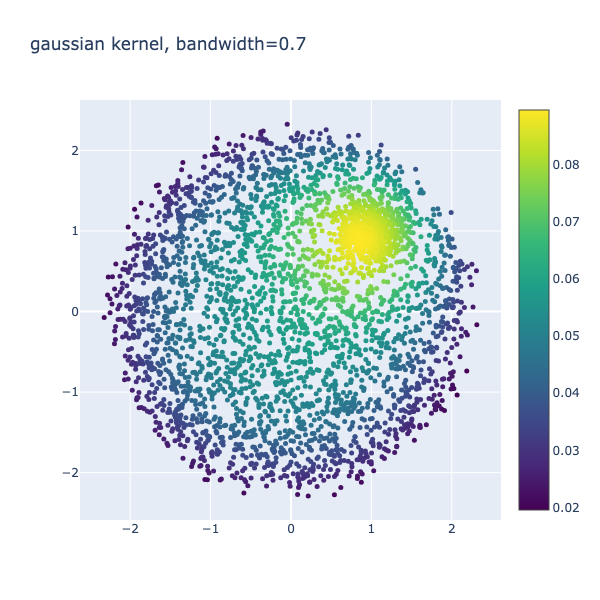|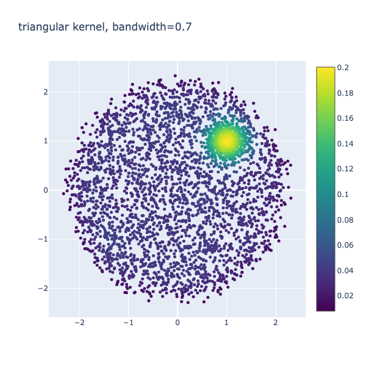|

Observations:

- Box kernel gives sharper boundaries while Gaussian produces smooth density estimates. Triangular lies in the middle of these two.
- Low bandwidth captures fine details which are smoothened out by higher bandwidths

Here is the plot for GMM soft clustering on the same dataset:

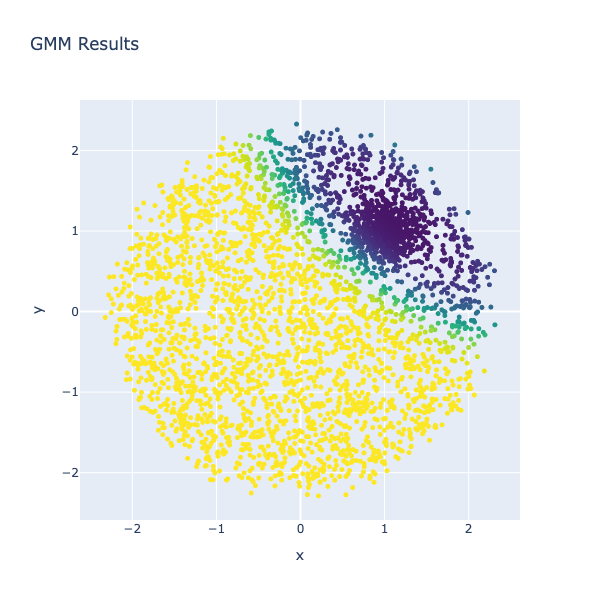

Observations:

- The output is a clustered scatter plot, with colours representing different clusters, each associated with a Gaussian component. GMM assigns each point a probability of belonging to each cluster, leading to soft boundaries where colours blend. This is different from KDE which estimates the density at each region.
- The main difference in the plots seems to be the assignment of the sparse points in the top right region. In KDE they are represented as low density equivalent to those points in the centre of the circle. In GMM, they are predicted to be part of the denser cluster at the top right.

GMM on different number of components:

|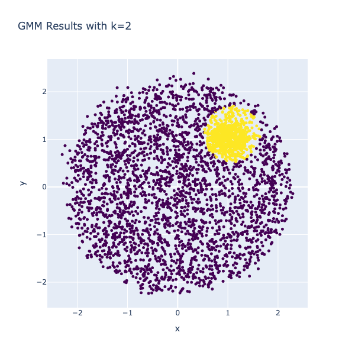|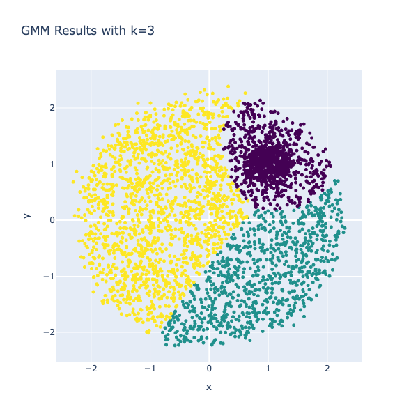|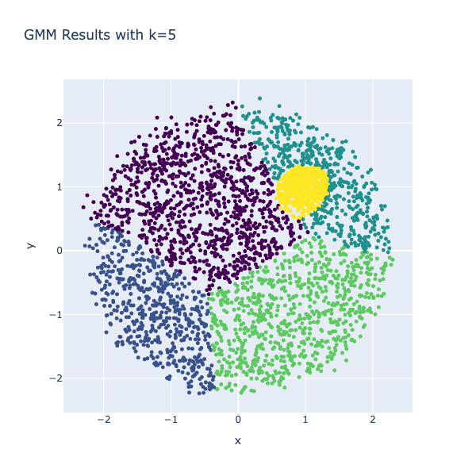|
|-|-|-|

Observations:

- The GMMs with more than two components fail to segment the data consistently. The smaller denser circle of points is segmented out differently in the three above plots.
- KDE estimates are consistent as they model inherent property of the data itself.

# Hidden Markov Models (HMM)

## Dataset

The kaggle dataset has been downloaded to `data/external/recordings`

MFCC coefficients represent the audio signal on a mel scale, emphasising frequencies that are more important for human perception, especially in speech. The intensity of each cell represents the amplitude of that particular time-frequency component.

Here are the MFCC features for digits 0-9 of George_0 and Jackson_0 from the dataset:

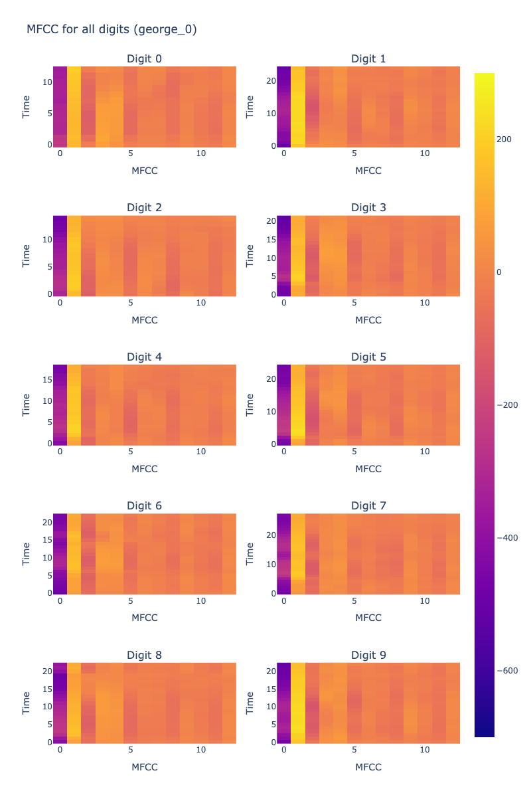

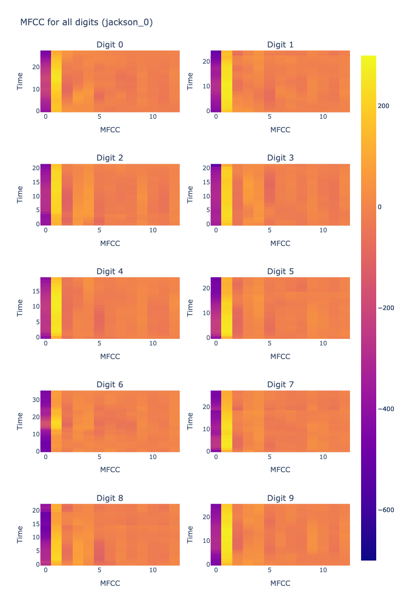

- Each digit has unique patterns in the frequency bands associated with the spoken syllable for the digit. Higher-intensity regions appear at specific time intervals, which differ from one digit to another.
- Some digits show more variation over time, while others have more consistent patterns, suggesting that certain numbers might be pronounced with more gradual or sudden changes in frequency content.

Why choose HMM?

Each digit has a unique sequence of sounds which can be modelled as state transitions in an HMM. This should be able to handle variations in pronunciation or accent.

## Model Architecture

For each digit, a separate `GaussianHMM(*n_components*=5, *covariance_type*='diag')` model is trained from `hmmlearn`

For predicting, we check the input sequence with all the 10 models and output the digit corresponding the model with the highest probability.

## Results

Here are the outputs of training the model on an 80-20 train-test split:

```python
Train accuracy: 84.29%
Test accuracy: 82.33%
Self data accuracy: 40.00%
```

The lower accuracy on the test dataset is mostly due to no training on a similar voice which may lead to lower probability for the correct data. The model may have overfit the given voices and accent and a new voice performs bad.

# Recursive Neural Networks (RNN)

## Counting Bits

The generated binary dataset is stored in `data/processed/binary_dataset.csv` 

The dataloaders have a batch size of 1 as the length of each row is different and dependant on the length of the input binary stream.

The Loss Metric used for training and evaluation is Mean Absolute Error (MAE)

The `BinaryRNN()` class has implemented at `models/RNN/RNN.py`

### Model Results

- num_layers = 1, hidden_size = 16, dropout = 0, batch_norm = False
    
    ```python
    Epoch 5/5, Train Loss: 0.0745644370816648
    Validation Loss: 0.039563123136758804
    Validation Accuracy: 99.70%
    ```
    
    The main model which will be used for all the further tasks. The accuracy is good and the model neither overfits or underfits.
    
- num_layers = 6, hidden size = 32, dropout = 0, batch_norm = False
    
    ```python
    Epoch 3/3, Train Loss: 1.037107551785186
    Validation Loss: 0.9532279968261719
    Validation Accuracy: 37.78%
    ```
    
    With more hidden layers and larger size, the model is overfitting the training data and the performance on the validation set reduces drastically.
    
- num_layers = 6, hidden size = 32, dropout = 0.3, batch_norm = False
    
    ```python
    Epoch 3/3, Train Loss: 0.5259883716318756
    Validation Loss: 0.04752032831311226
    Validation Accuracy: 98.04%
    ```
    
    Adding a dropout layer to an overfit model reduces the overfitting.
    
- num_layers = 6, hidden size = 32, dropout = 0.5, batch_norm = True
    
    ```python
    Epoch 3/3, Train Loss: 1.0203865552052855
    Validation Loss: 0.9108434319496155
    Validation Accuracy: 37.00%
    ```
    
    Adding both a batch-norm layer and a dropout significantly reduces the accuracy as the model now underfits the data.
    

### Random Baseline

The random baseline model predicts a random number between 0 and the the length of the sequence. Here are the results:

```python
Train Loss: 2.5504125
Train Accuracy: 15.05%
Validation Loss: 2.5585
Validation Accuracy: 14.65%
Test Loss: 2.561
Test Accuracy: 15.00%
```

The values between the three splits of the dataset is consistent as the predictions are random.

### Generalisation

The longer dataset is the dataset created by generating 1000 samples of sequence length 17-32. Here are the model results:

```python
Longer Test Loss: 1.871462345123291
Longer Test Accuracy: 44.00%
# original test data
Test Loss: 0.039147067815065384
Test Accuracy: 99.72%
```

Here is the plot of length vs the MAE and Accuracy of the model:

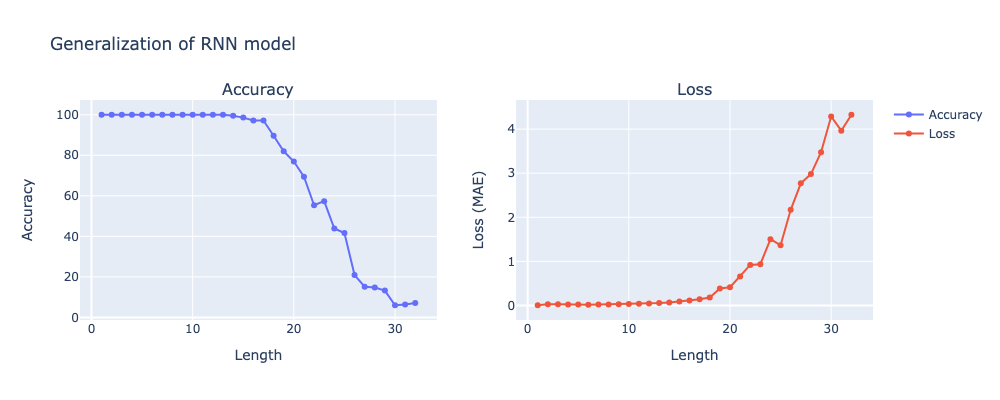

Observations:

- The RNN model learns very well (almost 100% accuracy) till length 15. After that the accuracy decreases and loss increases for higher lengths slowly till it reaches almost 0% accuracy for length 30.
- The gradual increase in loss with length is mostly due to the short term memory of the RNNs as the gradients get vanishingly small. This leads to incorrect results for higher lengths. The best way to solve this issue is to use an LSTM instead of an RNN which can retain long term information.

## Optical Character Recognition

The words are taken from nltk corpus and are assumed to have a length of less than 10.

OpenCV has been used to render text on images.

Here are few sample dataset points:

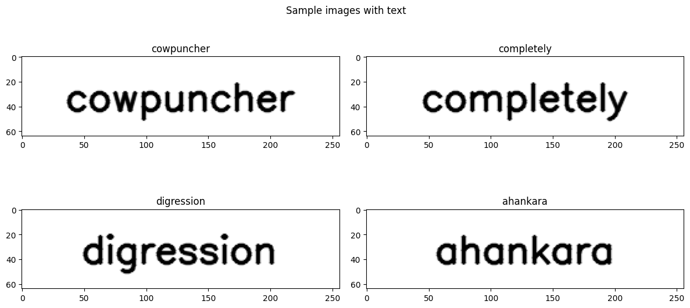

```python
cowpuncher [ 3. 15. 23. 16. 21. 14.  3.  8.  5. 18.]
completely [ 3. 15. 13. 16. 12.  5. 20.  5. 12. 25.]
digression [ 4.  9.  7. 18.  5. 19. 19.  9. 15. 14.]
ahankara [ 1.  8.  1. 14. 11.  1. 18.  1.]
```

### Model Results

- cnn_layers=2, cnn_channels=[16,16], rnn_hidden_size=16, rnn_num_layers=1, dropout=0
    
    ```python
    Epoch 5/5, Train Loss: 0.001078508010052234
    Validation Loss: 7.672636456845794e-06
    Validation Accuracy: 100.00%
    ```
    
    The main model which will be used for all the further tasks. The accuracy is good and the model neither overfits or underfits.
    
- cnn_layers=3, cnn_channels=[1,1,1], rnn_hidden_size=16, rnn_num_layers=1, dropout=0
    
    ```python
    Epoch 3/3, Train Loss: 0.27340517593570984
    Validation Loss: 0.27046820521354675
    Validation Accuracy: 77.29%
    ```
    
    Increasing the number of CNN layers leads to loss of spatial information which leads to slightly worse accuracy.
    
- cnn_layers=3, cnn_channels=[1,1,1], rnn_hidden_size=16, rnn_num_layers=1, dropout=0
    
    ```python
    Epoch 3/3, Train Loss: 0.0573261857391916
    Validation Loss: 0.05468371883034706
    Validation Accuracy: 97.56%
    ```
    
    Reducing to one CNN layer there are a lot of outputs which need to represent a 10 letter word, leading to slightly worse accuracy.
    

Here is the output of the main model on the dataset split:

```python
Train Loss: 7.499895673390711e-06
Train Accuracy: 100.00%
Val Loss: 7.672630090382881e-06
Val Accuracy: 100.00%
Test Loss: 5.081411472929176e-06
Test Accuracy: 100.00%
```

### Random Baseline

The random baseline model predicts a random sequence of characters of the length of the word. Here are the results:

```python
Train Accuracy: 3.82%
Validation Accuracy: 3.88%
Test Accuracy: 3.90%
```

The values between the three splits of the dataset is consistent as the predictions are random.